# AI Chip Primer — 컴퓨터 구조, AI 가속기, 추론 시스템

> 컴퓨터 구조 기초부터 AI 가속기·LLM 추론 시스템까지 한 번에 훑는 정리 노트. 각 섹션 끝에 출처.

---

## 목차

- [Part 0. 도대체 왜 AI 칩이 필요한가](#part-0-도대체-왜-ai-칩이-필요한가)
- [Part 1. 컴퓨터가 명령어를 처리하는 방식 (구조 기초)](#part-1-컴퓨터가-명령어를-처리하는-방식-구조-기초)
- [Part 2. 메모리 계층과 Memory Wall](#part-2-메모리-계층과-memory-wall)
- [Part 3. LLM 추론 워크로드 — 왜 GPU도 놀고 있나](#part-3-llm-추론-워크로드--왜-gpu도-놀고-있나)
- [Part 4. 모델 경량화 (양자화·LoRA·KD)](#part-4-모델-경량화-양자화loraKD)
- [Part 5. 추론 시스템 최적화 (vLLM, Disaggregation, Dynamo)](#part-5-추론-시스템-최적화-vllm-disaggregation-dynamo)
- [Part 6. 분산 학습/추론과 인프라](#part-6-분산-학습추론과-인프라)
- [Part 7. AI 스케일링 법칙과 경제성](#part-7-ai-스케일링-법칙과-경제성)
- [Part 8. Edge vs Cloud, HW-SW 디버깅](#part-8-edge-vs-cloud-hw-sw-디버깅)
- [부록 A. 1줄 요약 카드 30장](#부록-a-1줄-요약-카드-30장)
- [부록 B. 약어 사전](#부록-b-약어-사전)

---

## Part 0. 도대체 왜 AI 칩이 필요한가

### 0.1 CPU vs GPU vs AI 가속기 — 1분 직관

- **CPU**: 똑똑한 직원 4~16명. 한 명 한 명이 복잡한 일을 빠르게 한다. 분기·조건문 잘 처리.
- **GPU**: 단순한 직원 수천 명. 한 명은 느리지만 똑같은 일을 동시에 시키면 압도적. 행렬 곱셈에 강함.
- **AI 가속기(LPU, TPU, NPU, …)**: 특정 모델(예: Transformer)만 잘하도록 만든 전용 칩. GPU보다 적은 코어, 큰 코어, 데이터 흐름 고정.

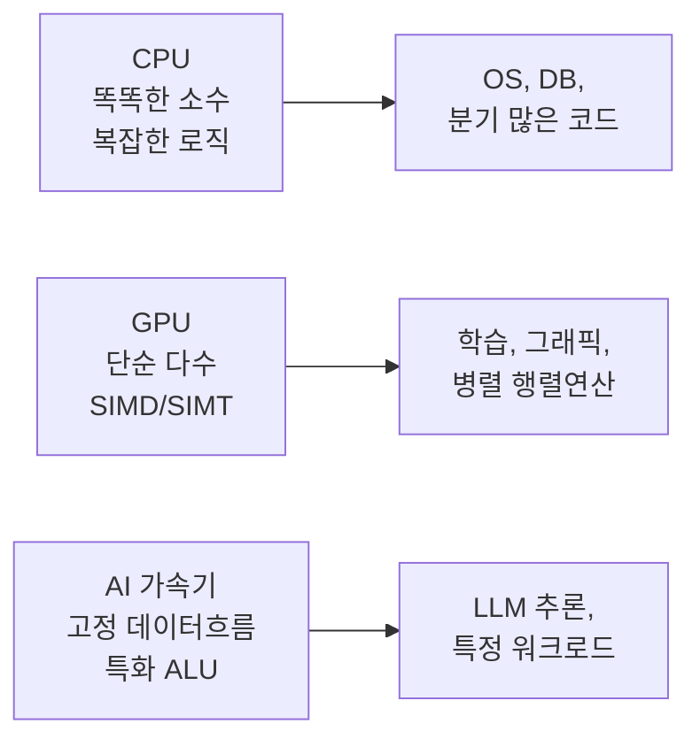

### 0.2 왜 굳이 AI 전용 칩을 만들까

세 가지 이유.

1. **모델 크기가 폭발**: GPT-3가 175B 파라미터(=350GB). 한 GPU에 안 들어감.
2. **연산 패턴이 단조로움**: LLM은 대부분 행렬-벡터 곱 + Attention. CPU의 분기 예측이나 GPU의 그래픽 기능은 낭비.
3. **메모리가 발목**: 모델은 410×/2년 자라는데 DRAM 대역폭은 1.6×/2년. 결국 칩은 연산기보다 메모리를 잘 다루는 설계로 가야 함.

이 세 가지 이유로 **메모리 대역폭을 최대한 활용하고, 데이터 재사용을 극대화하는 전용 칩**이 필요해졌다. 이게 LPU, TPU 같은 AI 가속기다.

---

## Part 1. 컴퓨터가 명령어를 처리하는 방식 (구조 기초)

### 1.1 Von Neumann Architecture — 모든 컴퓨터의 뼈대


*그림. Von Neumann 구조: 단일 메모리에서 명령어와 데이터를 모두 가져온다. Control Unit이 명령어를 해석하고, ALU가 연산을 수행하며, 메모리 유닛은 I/O 장치와 함께 시스템 버스로 연결된다. (Wikimedia Commons, Kapooht, CC BY-SA 3.0)*

```
   ┌─────────────────────────────┐
   │         Processor           │
   │  ┌───────────────────────┐  │
   │  │     Control Unit      │  │  ← 다음에 뭐 할지 결정
   │  ├───────────────────────┤  │
   │  │   Arithmetic Unit     │  │  ← 실제 덧셈·곱셈
   │  ├───────────────────────┤  │
   │  │        SRAM           │  │  ← 칩 안의 빠른 메모리 (작음)
   │  └───────────────────────┘  │
   └─────────────┬───────────────┘
                 │
   ┌─────────────▼───────────────┐
   │     External Memory         │  ← DRAM (크지만 느림)
   │  (Instructions + Data)      │
   └─────────────────────────────┘
```

핵심: **명령어와 데이터가 같은 메모리에 산다**. 그래서 CPU는 끊임없이 명령어 가져오기와 데이터 가져오기를 반복하면서 메모리 버스를 오가야 함 → 이게 **Von Neumann bottleneck**.

### 1.2 ISA (Instruction Set Architecture) ⭐⭐ 핵심

**ISA = 이 칩이 알아듣는 명령어 목록 + 그 명령어 포맷의 규칙**

비유: 식당 메뉴판. CPU는 주방, 컴파일러는 손님. 메뉴판이 잘 정리돼 있으면 주문도 빨리 들어가고 주방도 빨리 만든다.

#### CISC vs RISC vs VLIW — 3가지 철학

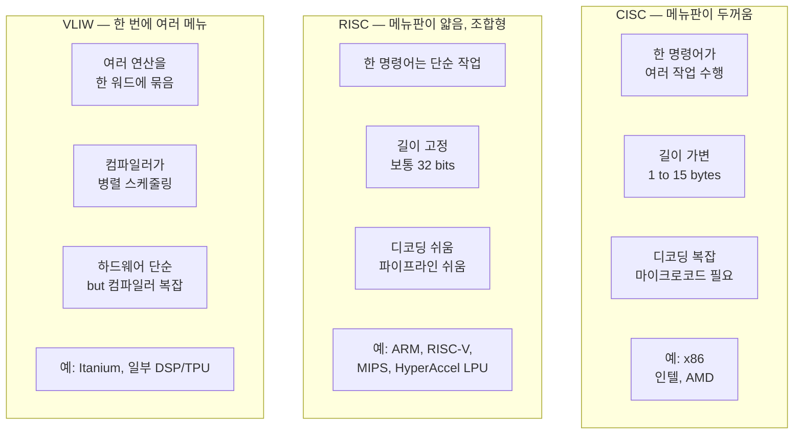

**비교 표**:

| 항목 | CISC | RISC | VLIW |
|------|------|------|------|
| 명령어 길이 | 가변 | **고정** | 매우 김 (고정) |
| 명령어 복잡도 | 복잡 (한 명령어 = 여러 작업) | 단순 (load/store 모델) | 여러 단순 명령어를 한 워드에 묶음 |
| 사이클/명령어 | 높음 (1 명령어 = 여러 cycle) | **낮음** (대부분 1 cycle) | 낮음 (병렬 슬롯) |
| 명령어/프로그램 | 적음 | 많음 | 적음 (병렬화로 단축) |
| 디코딩 난이도 | 어려움 (마이크로코드) | **쉬움** | 쉬움 (컴파일러가 정리) |
| 병렬 처리 | 하드웨어 OoO 의존 | 하드웨어 OoO/super-scalar | **컴파일러 정적 스케줄링** |
| 좋은 경우 | 코드 크기 작아야 할 때 | 파이프라이닝·전용 칩 | **ILP가 매우 풍부할 때** |
| 대표 예 | x86 | ARM, RISC-V, MIPS, 대부분의 AI 가속기 | Itanium, 일부 DSP/GPU shader |

> **출처**: [RISC vs CISC (GeeksforGeeks)](https://www.geeksforgeeks.org/computer-organization-architecture/computer-organization-risc-and-cisc/), [VLIW Microprocessors (Computerworld)](https://www.computerworld.com/article/1368853/vliw-microprocessors.html)

#### 왜 LPU(HyperAccel)는 RISC를 골랐나

강의에서 강조했던 이유:

1. **워드 고정** → 명령어 fetch와 decode 회로가 단순 → 파이프라인 깊게 박기 좋음
2. **인스트럭션 디코딩이 편함** → 더 작은 면적/전력으로 같은 IPC
3. **LLM 커널이 작은 단위(DotProduct, MatMul, LayerNorm)의 조합**으로 표현됨 → RISC 스타일이 어울림
4. **컴파일러 최적화** (Layer-Fusion, Data Forwarding, Instruction Overlapping, SRAM Usage)가 단순 ISA 위에서 더 잘 됨

VLIW를 안 고른 이유: LLM은 토큰 단위로 의존성이 강함(현재 토큰이 다음 토큰의 입력) → ILP 슬롯이 잘 안 채워짐 → VLIW의 장점이 죽는다.
CISC를 안 고른 이유: 가속기는 단순 반복 연산 위주 → 복잡한 명령어 풍부함이 필요 없음.

### 1.3 파이프라이닝 — 컨베이어 벨트로 처리량 늘리기

직관: 자동차 공장에서 차 한 대를 5단계로 만들 때, 한 대씩 끝내고 다음 작업하는 게 아니라 **각 단계에서 동시에 다른 차를 작업**한다. 그러면 처음 한 대는 똑같이 걸리지만 그 다음부터는 1단계씩만 더 걸린다.

#### 5-stage MIPS Pipeline


*그림. 5-stage 파이프라인 타이밍. 가로축이 시간(클럭), 세로축이 명령어. 매 사이클마다 5개 명령어가 서로 다른 단계에 동시에 머문다. 첫 명령어가 끝난 뒤부터는 매 사이클마다 1개씩 명령어가 완료된다. (Wikimedia Commons, public domain)*

```
사이클:        1     2     3     4     5     6     7     8
명령어 i:    [IF][ID ][EX][MEM][WB]
명령어 i+1:        [IF][ID ][EX][MEM][WB]
명령어 i+2:              [IF][ID ][EX][MEM][WB]
명령어 i+3:                    [IF][ID ][EX][MEM][WB]
```

| 단계 | 풀네임 | 하는 일 |
|------|--------|---------|
| **IF** | Instruction Fetch | PC가 가리키는 명령어를 메모리에서 가져옴 |
| **ID** | Instruction Decode | 명령어 해석 + Register File에서 source 읽기 |
| **EX** | Execute | ALU 연산 (덧셈, 곱셈) 또는 주소 계산 |
| **MEM** | Memory Access | 데이터 메모리에서 load/store |
| **WB** | Write Back | 결과를 Register File에 기록 |

> **출처**: [MIPS Pipelining (Cooper Union)](https://ee.cooper.edu/~curro/comparch/pipeline/chapter4_pipelining_END_FA11.pdf)

#### 파이프라인이 깨지는 경우 — Hazard 3종 세트

1. **Data Hazard**: 앞 명령어의 결과를 뒤 명령어가 곧바로 써야 함.
   - 해결: **Forwarding (bypass)** — EX 단계 결과를 다음 명령어 EX로 직접 전달.
2. **Control Hazard**: 분기(if)가 어디로 갈지 IF 시점엔 모름.
   - 해결: **Branch Prediction** — 통계적으로 어느 쪽일지 예측.
3. **Structural Hazard**: 두 명령어가 같은 자원(예: 메모리 포트)을 동시에 원함.
   - 해결: 자원 복제 or 우선순위 부여.

### 1.4 LPU(AI 가속기) 설계 6요소 ⭐

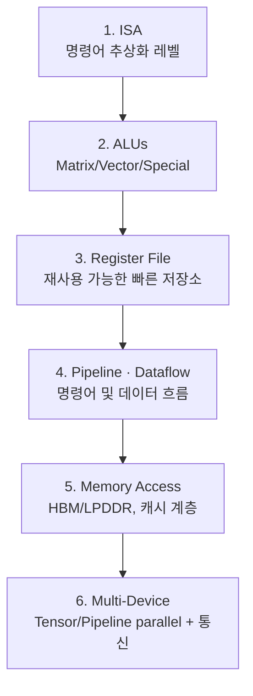

이 6가지가 모두 PPA에 영향을 준다.

### 1.5 PPA (Power · Performance · Area) — 반도체 설계의 3대 trade-off

**세 변수를 동시에 좋게 할 수 없다**. 셋이 삼각형으로 묶여 있다.

```
            Performance
                ▲
                │
                │
    Power ◄────┼────► Area
```

- **Performance 올리려면** → 더 큰 ALU, 더 빠른 클럭 → **Power 상승, Area 상승**
- **Power 줄이려면** → 클럭 다운, voltage 다운 → **Performance 하락**
- **Area 줄이려면** → ALU/캐시 줄임 → **Performance 하락**

→ AI 칩 설계 = 이 워크로드에선 어느 코너를 양보할지 결정하는 일.

### 1.6 시뮬레이션 — 칩을 만들기 전에 시뮬레이터로 검증

칩 하나 만드는 데 수십억 원·1년 이상 걸림. RTL 짜기 전에 여러 단계의 시뮬레이션으로 미리 검증해야 함.

| 시뮬레이터 | 무엇을 보나 | 자동차 비유 | 사용 시점 |
|-----------|-----------|----------|---------|
| **Behavioral** | 알고리즘·시스템 수준 동작 | GPS 내비게이션 | 설계 초기 |
| **Functional** | 비트 정확성·논리 검증 | Test Drive | RTL 전 |
| **Analytical** | 성능 빠른 추정 (수식) | Spec Sheet | DSE |
| **Cycle-Accurate** | 사이클 단위 타이밍 검증 | Engine Dyno | RTL 후 |
| **Power/Area** | 전력·면적 추정 | Fuel and Size Test | 최적화 단계 |

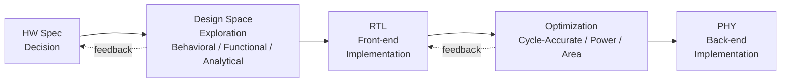

#### Event-Driven Simulation — 빠른 시뮬레이션의 핵심

매 클럭마다 모든 모듈을 시뮬레이트하면 너무 느림. 그래서 **다음 이벤트(state 변화) 시점으로 시간을 점프**.

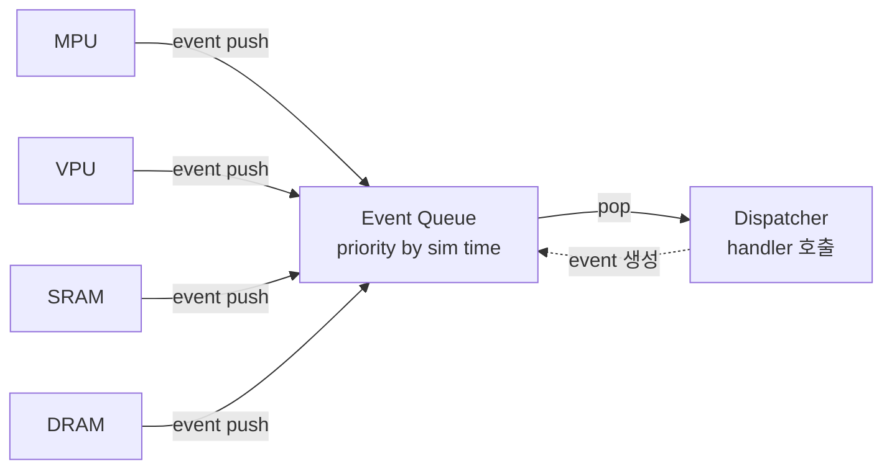

- **Event**: state 변화 (예: data 도착, MAC 완료, buffer free)
- **Event Queue**: 시뮬레이션 시간 기준 priority queue
- **Dispatcher**: queue에서 event pop → 해당 handler 호출

---

## Part 2. 메모리 계층과 Memory Wall

### 2.1 메모리는 빠를수록 작다 — 계층 구조


*그림. 메모리 계층 피라미드. 위로 갈수록 빠르고 작고 비싸다(Register/Cache). 아래로 내려갈수록 크고 싸지만 느리다(DRAM, SSD, Tape). 좋은 컴퓨터/AI 가속기 설계 = "자주 쓰는 데이터를 피라미드 위쪽에 최대한 오래 두는 것". (Wikimedia Commons, public domain)*

```
↑ 빠름, 작음, 비쌈
┌──────────────┐
│  Register    │  1 cycle, ~KB                   (ALU 옆)
├──────────────┤
│  L1 Cache    │  ~4 cycles, ~32-64 KB
├──────────────┤
│  L2 Cache    │  ~12 cycles, ~256-512 KB
├──────────────┤
│  L3 Cache    │  ~40 cycles, ~수 MB
├──────────────┤
│  SRAM (on-chip scratchpad)   ~100 KB-MB        (AI 칩에선 매우 중요)
├──────────────┤
│  HBM/DRAM    │  ~수백 cycles, ~수십-수백 GB
├──────────────┤
│  NVMe SSD    │  ~수만 ns, ~TB
├──────────────┤
│  Network/Object Storage      ~ms, ~PB
└──────────────┘
↓ 느림, 큼, 쌈
```

### 2.2 AI 칩이 쓰는 DRAM 종류 — HBM vs GDDR vs DDR/LPDDR


*그림. HBM 단면. 여러 장의 DRAM die를 위로 쌓고, 위·아래를 **TSV(Through-Silicon Via)**라는 수직 구멍으로 연결한다. 옆에는 GPU/CPU/SoC die가 있고, 둘은 **인터포저(Interposer)** 위에 나란히 놓여 패키지 안에서 짧고 넓은 길로 통신한다. 이 구조 덕에 클럭이 낮아도 1024-bit 이상의 광폭 인터페이스로 1 TB/s 이상의 대역폭이 나온다. (Wikimedia Commons, CC BY-SA)*

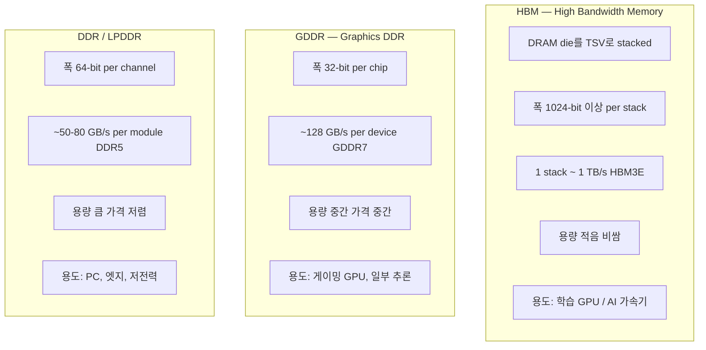

| 종류 | 대역폭(per device/stack) | 용량 | 전력 효율 | 가격 | 주 용도 |
|------|-------|------|----------|------|---------|
| **HBM3E** | ~1 TB/s 이상 | 작음 (24-36GB/stack) | 좋음 | 최고가 | NVIDIA H100/B200, AI 가속기 |
| **GDDR7** | ~128 GB/s | 중간 | 중간 | 중간 | 게이밍/추론 GPU |
| **DDR5** | ~50-80 GB/s | 큼 (수백 GB/server) | 낮음 | 저렴 | CPU 메인 메모리 |
| **LPDDR5** | ~70 GB/s | 중간 | **매우 좋음** | 저렴 | 모바일, 엣지 AI |

> **출처**: [HBM vs DDR (intuitionlabs)](https://intuitionlabs.ai/pdfs/hbm-vs-ddr-key-differences-in-memory-technology-explained.pdf), [GDDR vs HBM (FiberMall)](https://www.fibermall.com/blog/gddr-hbm.htm)

**핵심 직관**: HBM은 넓은 길에 천천히 다님 (1024-bit 폭, 낮은 클럭). DDR은 좁은 길에 빠르게 (64-bit, 높은 클럭). AI는 데이터가 워낙 많아서 넓은 길 = HBM이 이긴다.

### 2.3 Memory Wall ⭐⭐ — 가장 큰 포인트

```
모델 크기:           410x / 2년 ████████████████████████
DRAM 대역폭:         1.6x / 2년 ██
Interconnect 대역폭:  1.4x / 2년 █
```

모델은 폭발적으로 커지는데 **메모리는 그 속도를 못 따라간다**. → AI 인프라의 진짜 병목은 연산기가 아니라 메모리.

직접적인 결과:
- 학습은 어떻게든 컴퓨트 바운드로 끌어가지만,
- **추론(특히 generation)은 거의 항상 메모리 바운드**.

### 2.4 Roofline Model ⭐⭐ — 어디서 막혀 있나 한눈에

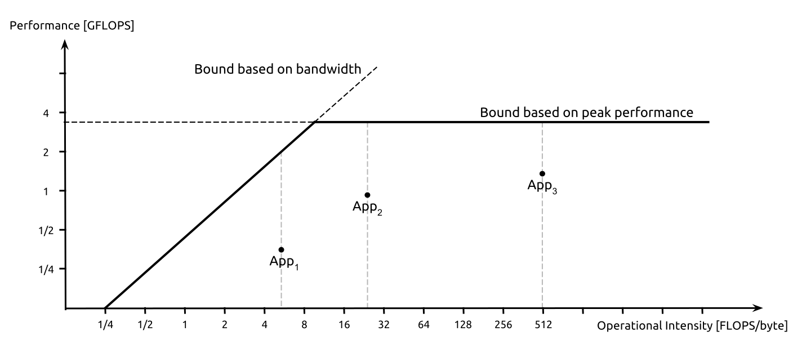

*그림. Roofline 모델 실제 예시. 검정선의 **기울어진 부분 = 메모리 대역폭 × OI** (BW-limited 영역), **평평한 부분 = peak compute** (compute-limited 영역). 점들은 각각의 커널(kernel)이 이 칩에서 어디 위치하는지 보여준다. 점이 기울어진 부분 아래에 박혀 있으면 메모리 최적화가 답, 평평한 부분 아래라면 컴퓨트 최적화가 답이다. (Wikimedia Commons, Giu.natale, CC BY-SA 4.0)*

```
   Performance
   (ops/sec)
        ▲
   Peak ┼──────────────────────────  ← Compute roof
        │           ◇                  (Compute-Limited 영역)
        │       ◇                      ← Inflection Point
        │      / Slope = BW
        │   ◇                          (BW-Limited 영역)
        │ ◇
        └──────────────────────────►
       Optimal      Operational Intensity (ops/byte)
       OI 지점
```

- **X축 = Operational Intensity (OI) = 연산량 / 메모리 접근 바이트**
- **Y축 = Performance (ops/sec)**
- 두 개의 천장(roof):
  - 기울어진 천장 = **Memory Bandwidth x OI**
  - 평평한 천장 = **Peak Compute**
- 둘이 만나는 지점 = **Machine Balance (Ridge/Inflection Point)**

직관:
- OI가 낮으면 (1 byte 읽고 연산 별로 안 함) → **BW-Limited**. 더 빠른 메모리만이 답.
- OI가 높으면 (1 byte 읽고 연산 많이 함) → **Compute-Limited**. 더 많은 ALU가 답.

> **출처**: [Roofline Model (Wikipedia)](https://en.wikipedia.org/wiki/Roofline_model), [Roofline (NERSC)](https://docs.nersc.gov/tools/performance/roofline/)

### 2.5 Arithmetic Intensity — 행렬 연산 두 종류

**Matrix x Matrix** (예: 학습 batch GEMM):
- (n x n) x (n x n) → 결과 (n x n)
- 연산: 2n^3
- 메모리: 3n^2 (두 행렬 읽고 한 행렬 쓰기)
- **OI ≈ 2n** ← n에 비례. n 크면 compute-bound로 갈 수 있음.

**Matrix x Vector** (예: LLM decode 1 token):
- (n x n) x (n x 1) → (n x 1)
- 연산: 2n^2
- 메모리: n^2 + 2n
- **OI ≈ 2** ← 상수. 거의 무조건 **memory-bound**.

**직관**: LLM 추론 generation은 왜 memory-bound인가? → 토큰 1개씩 처리하면 행렬-벡터 곱이고, OI≈2라 무조건 메모리에 발목 잡힌다.

### 2.6 GPT-3 175B 추론 — 숫자로 확인

조건: 5x H100, FP16, 350GB 파라미터, total memory 400GB, total bandwidth 15TB/s.

```
1 토큰 latency = 파라미터 크기 / 메모리 대역폭
              = 350GB / 15TB/s
              = 23.3 ms

200 토큰 생성 = 23.3 ms x 200 = 4.66 s

GPU Utilization 계산:
   필요 연산 = 15TB/s x 2 (intensity)         ← memory에서 흘러오는 만큼만 연산 가능
   가용 연산 = 990 TFLOPS x 5 (H100 5장)
   utilization = (15TB/s x 2 / 2B per fp16) / (990 TFLOPS x 5)
              ~ 0.003 = 0.3%
```

**0.3%!** H100의 비싼 컴퓨트가 99.7% 놀고 있음. → 이게 추론 가속기들이 GPU와 다른 방향(고대역폭 + 큰 코어 + dataflow 고정)으로 가는 근본 이유.

---

## Part 3. LLM 추론 워크로드 — 왜 GPU도 놀고 있나

### 3.1 Transformer Decoder의 한 layer — 단계별 그림


*그림. Vaswani et al. 2017 원조 Transformer 전체 구조. 왼쪽이 Encoder, 오른쪽이 Decoder. LLM(GPT, Llama 등)은 보통 Decoder만 쌓아올린 구조(Decoder-only). 빨간 블록이 Multi-Head Attention, 파란 블록이 Feed Forward Network, 노란색이 LayerNorm/Residual. (Wikimedia Commons, CC BY-SA)*


*그림. Transformer 1개 layer를 줌인한 모습. **Multi-Head Attention → Add&Norm → FFN → Add&Norm**의 4-step 구조가 한 layer. 큰 모델은 이 layer를 수십~수백개 쌓아올린다 (Llama 70B = 80 layers). (Wikimedia Commons, CC BY-SA)*

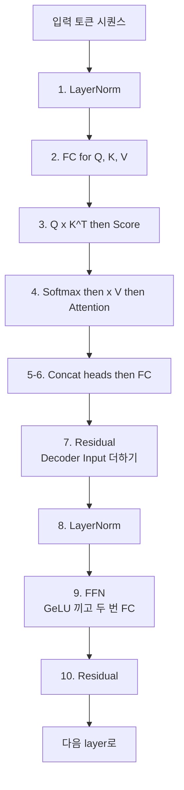

**LM Head** (마지막에 한 번):

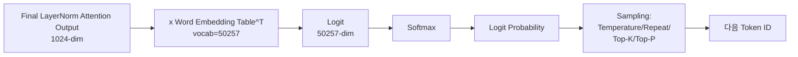

### 3.2 Prefill vs Decode — 추론은 두 단계로 나뉜다 ⭐⭐

```
Prompt: "Alan Turing is a"
            │
            ▼
   ┌────────────────────┐
   │  PREFILL           │   ← 입력 전체를 한 번에 처리
   │  (Compute-bound)   │     Matrix x Matrix
   │  → 1st token       │     GPU 컴퓨트 잘 활용
   └────────────────────┘
            │
            ▼ "computer"
   ┌────────────────────┐
   │  DECODE            │   ← 토큰 1개씩 반복 생성
   │  (Memory-bound)    │     Matrix x Vector
   │  → 2nd, 3rd, ...   │     매 step마다 모델 전체 + KV 다시 read
   └────────────────────┘
            │
            ▼ "scientist who..."
```

**Prefill**:
- 프롬프트의 모든 토큰을 한꺼번에 layer에 넣을 수 있음 (병렬).
- 행렬-행렬 곱셈 → OI 크다 → **compute-bound**.
- TTFT (Time-To-First-Token)이 여기서 결정.

**Decode**:
- 새 토큰 1개의 Q만 만들고, 그동안 쌓인 모든 K, V와 attention.
- 행렬-벡터 곱셈 → OI ≈ 2 → **memory-bound**.
- TBT (Time-Between-Tokens)이 여기서 결정.

이 둘이 한 GPU에 같이 있으면 둘 다 비효율 → 5장에서 **Disaggregation**으로 해결.

### 3.3 KV Cache ⭐⭐ — Attention 가속의 마스터 키

**왜 캐시가 필요한가**: Attention은 매 토큰마다 이전 모든 토큰의 K, V가 필요. 매번 다시 계산하면 O(N^2) → 토큰 늘수록 폭발.

**해법**: 한 번 계산한 K, V를 메모리에 저장. 새 토큰은 새 K, V만 계산해서 cache에 append.

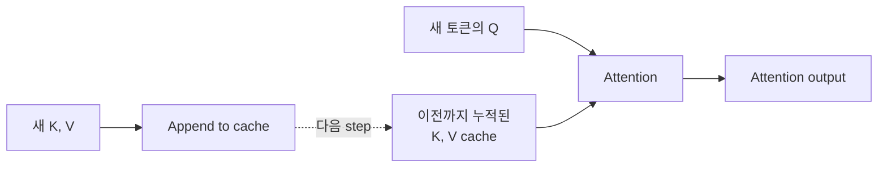

#### KV Cache 메모리 계산 공식 ⭐

```
KV memory (bytes)
   = 2                          ← K와 V 둘 다
   x num_layers
   x num_kv_heads               ← GQA/MQA면 더 작음
   x head_dim
   x seq_len
   x batch_size
   x bytes_per_element          ← FP16=2, INT8=1, INT4=0.5
```

**예시: Llama 3.1 70B, BF16, 128K context, batch=1**
- 2 x 80 x 8 x 128 x 131072 x 1 x 2 = **42.9 GB**

**한 GPU(H100 80GB)에 모델(140GB) + KV(42.9GB) 다 안 들어감!** → 분산 + 캐시 압축이 필수.

> **출처**: [KV cache memory calc (Lyceum)](https://lyceum.technology/magazine/kv-cache-memory-calculation-llm/)

### 3.4 Attention 변형 — KV cache를 줄이려는 노력들 ⭐

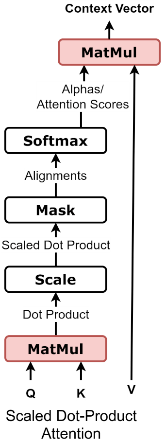

*그림. Scaled Dot-Product Attention 1개. 입력으로 들어온 token 벡터들이 Q, K, V로 projection되고, Q·K^T → scale → softmax → ×V 흐름을 거쳐 attention output이 된다. KV cache는 이 그림에서 K, V 텐서를 매 step마다 재활용하기 위해 저장하는 것. (Wikimedia Commons, CC BY-SA)*


*그림. Multi-Head Attention. 위 단일 head의 attention을 H개(예: 32) 병렬로 돌린 뒤 결과를 concat. 이때 각 head마다 자체 K, V를 갖는 게 **MHA**(원조). GQA는 H개 Q heads를 그룹으로 묶어 K/V를 공유, MQA는 K/V 1개만, **MLA**는 K/V를 latent로 저차원 압축해서 저장. 4가지가 KV cache 크기와 품질 사이의 trade-off를 다르게 푼다. (Wikimedia Commons, CC BY-SA)*

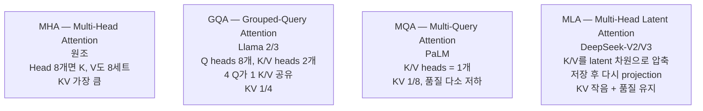

| 종류 | KV 크기 | 품질 | 대표 모델 |
|------|---------|------|----------|
| MHA | 가장 큼 | 가장 좋음 | 원조 Transformer, GPT-2/3 |
| GQA | 중간 (1/4~1/8) | 거의 동일 | Llama 2, Llama 3, Mistral, Qwen |
| MQA | 가장 작음 (1/N) | 살짝 떨어짐 | PaLM, Gemini Nano |
| **MLA** | 작음 (latent로 압축) | **MHA보다도 좋음** | DeepSeek-V2/V3 |

**MLA의 핵심 트릭**: K, V를 K = W_K · c, V = W_V · c 형태로 분해. KV cache엔 작은 latent c만 저장. 추론 시 projection으로 복원. compression이 학습된 latent space에서 일어나므로 정보 손실 최소.

> **출처**: [DeepSeek-V2 paper](https://arxiv.org/abs/2405.04434), [Multi-Head Latent Attention (Raschka)](https://sebastianraschka.com/llm-architecture-gallery/mla/)

### 3.5 RoPE, MoE, GQA — 모던 LLM 3대 기법

- **RoPE (Rotary Positional Embedding)**: 위치 정보를 회전 행렬로 주입. 절대 위치보다 상대 위치를 잘 표현. Llama, Qwen 등 거의 표준.
- **MoE (Mixture of Experts)**: layer마다 expert N개 두고 라우터가 일부만 활성화. 모델 크기는 크지만 실제 활성 파라미터는 작음 → 학습/추론 효율 상승. DeepSeek-V3, Mixtral.
- **GQA**: 위 표 참고.


*그림. DeepSeek-V2 아키텍처 — MoE와 MLA를 동시에 사용한다. **위쪽(MoE)**: FFN을 routed expert N개와 shared expert로 분리하고, router가 각 토큰마다 top-K expert만 골라 활성화. **아래쪽(MLA)**: Q는 그대로 두지만, K와 V는 작은 latent 차원으로 압축해서 KV cache에 저장 → 추론 시 다시 projection으로 복원. MHA 대비 KV cache 메모리 크게 절약 + 품질은 오히려 향상. (Wikimedia Commons, CC BY-SA)*

---

## Part 4. 모델 경량화 (양자화·LoRA·KD)

### 4.1 양자화 — 비트를 줄여 메모리 줄이기

**왜 필요한가**: FP16 → INT8 = 메모리 반 토막. INT4 = 1/4. 모델이 GPU 1장에 들어가게 만들 수 있음.

```
FP32:  [부호1][지수8][가수23]        ← 32 bits, 학습 기본
FP16:  [부호1][지수5][가수10]        ← 16 bits, 추론·학습
BF16:  [부호1][지수8][가수7 ]        ← 16 bits, FP32와 같은 dynamic range
FP8:   [부호1][지수4 or 5][가수3 or 2]  ← 8 bits, H100 native
INT8:  [부호1][정수7 ]               ← 8 bits, 정수 연산만
INT4:  [부호1][정수3 ]               ← 4 bits, 압축률 상승 정확도 하락
```

### 4.2 양자화 흐름 — 두 패턴

**(a) W8/A8 양자화** — 정수 그대로 계산

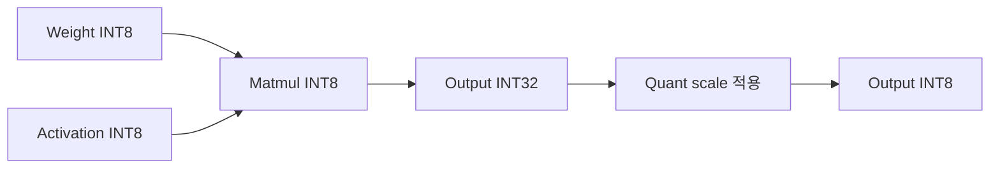

**(b) W4/A16 양자화 (AWQ 등)** — Weight만 4bit, 연산은 FP16

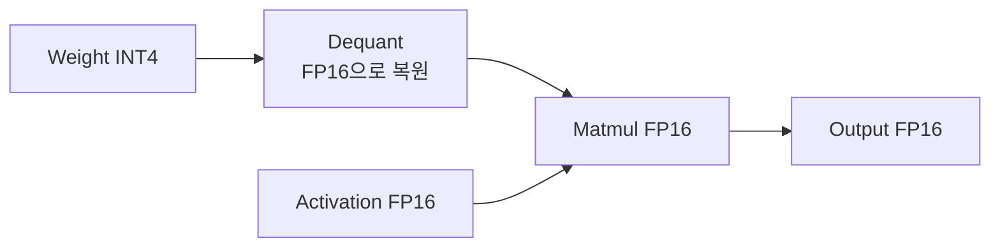

**중요 포인트**: (b)에선 **on-the-fly dequant**가 들어가서 그 비용을 무시 못 함. 하지만 weight만 줄여도 모델 크기·로딩 시간은 1/4이라 추론 인프라엔 이득.

### 4.3 AWQ — Salient weight를 살린다

**관찰**: 모든 weight가 똑같이 중요하지 않다. **1%의 salient weight를 보호하면 quantization 오차가 크게 줄어든다**.

**누가 salient인가?** Weight 자체가 큰 게 아니라, **그 weight를 곱하는 activation 채널이 큰 weight**. → 이름 그대로 Activation-aware.

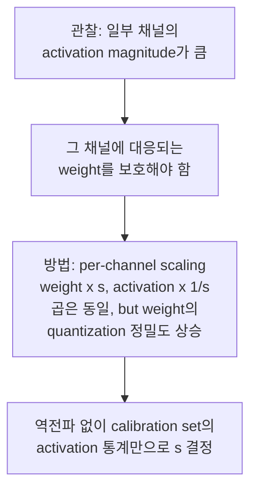

**효과**:
- W4 양자화에서도 PPL(perplexity) 손실 거의 없음.
- HuggingFace FP16 대비 **3x 이상 추론 속도** (모바일·데스크탑 GPU 모두).

> **출처**: [AWQ paper (arXiv 2306.00978)](https://arxiv.org/abs/2306.00978), [MIT Han Lab](https://hanlab.mit.edu/projects/awq)

### 4.4 양자화 기법 한눈에

| 기법 | 무엇을 양자화 | 핵심 아이디어 | 주 용도 |
|------|--------------|-------------|---------|
| **LLM.int8()** | W + A → INT8 | Outlier channel만 FP16으로 빼고 나머지 INT8 | 큰 모델 첫 INT8 안정화 |
| **SmoothQuant** | W + A → INT8 | Activation outlier를 weight 쪽으로 옮김 (smoothing) | Post-training W8A8 |
| **GPTQ** | W → INT4 | layer-wise Hessian 기반 minimum-error 양자화 | INT4 weight only |
| **AWQ** | W → INT4 | Salient weight 보호용 per-channel scaling | INT4 weight only |
| **FP8-LM** | W + A → FP8 | H100 native FP8로 학습 가능 | 학습+추론 |
| **PolarQuant / QJL / KIVI** | KV cache → INT4 등 | KV cache 전용 압축 | 긴 컨텍스트 |

### 4.5 양자화 외 경량화

- **Pruning (가지치기)**: 작은 weight를 0으로. Structured(채널/헤드 통째)/Unstructured.
- **Knowledge Distillation (KD)**: 큰 teacher 모델의 출력을 흉내내도록 작은 student 학습.
- **LoRA (Low-Rank Adaptation)**: 미세조정 시 W의 변화량을 dW = A · B (low rank)로 근사 → 학습 파라미터·메모리 대폭 절약.

---

## Part 5. 추론 시스템 최적화 (vLLM, Disaggregation, Dynamo)

### 5.1 vLLM의 PagedAttention ⭐⭐ — OS의 virtual memory를 KV cache에 가져오다

**문제**: 기존 추론 엔진은 KV cache를 **시퀀스마다 연속된 큰 블록**으로 미리 할당. 결과:
- **Internal fragmentation**: 실제로 짧은 시퀀스인데 max_seq_len 만큼 잡아둠 → 낭비.
- **External fragmentation**: 여러 시퀀스가 들쭉날쭉 끝나면서 메모리 사이사이 빈 틈.
- 결국 GPU 메모리의 **20~40%만 사용**했었음.

**해법**: KV cache를 **고정 크기 page(=block, 16 토큰 단위 등)** 로 자르고, 가상 메모리처럼 매핑.

```
Logical KV blocks (per request)            Physical KV blocks (GPU memory)
┌──────┐                                   ┌──────┐
│Block0│ ──┐                          ┌──► │Phys 7│
├──────┤   │                          │    ├──────┤
│Block1│ ──┼─ Block Table 매핑 ───────┼──► │Phys 1│
├──────┤   │   (page table 같은 역할) │    ├──────┤
│Block2│ ──┘                          │    │Phys 4│  ← 어디 있든 OK
└──────┘                              │    ├──────┤
                                      └──► │Phys 9│
                                           └──────┘
```

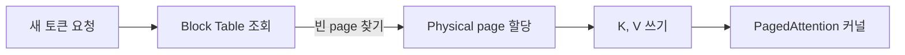

**효과**:
- 낭비는 시퀀스의 마지막(부분적으로 찬) page 하나뿐.
- **batch size를 훨씬 키울 수 있음** → throughput 2~4x.
- 두 요청이 같은 prefix를 가지면 **prefix caching** (page 공유)도 자연스럽게 됨.

> **출처**: [Efficient Memory Management for LLM (vLLM paper, arXiv 2309.06180)](https://arxiv.org/pdf/2309.06180), [PagedAttention (Red Hat Developer)](https://developers.redhat.com/articles/2025/07/24/how-pagedattention-resolves-memory-waste-llm-systems)

### 5.2 Continuous Batching — 한 step씩 새 요청 끼워넣기

**Static batching**: batch 안의 요청들이 다 끝날 때까지 새 요청을 못 끼움 → 짧은 요청이 빨리 끝나도 GPU가 빈자리로 놀음.

**Continuous batching (vLLM 등)**: **매 step마다** batch 구성을 다시 짠다. 끝난 요청은 빼고, 새 요청을 즉시 끼움.

```
시간 →
Static batching:    [R1 R2 R3 R4]________[R5 R6 R7 R8]
                                           ↑ R1~R4 다 끝날 때까지 기다림

Continuous batching: [R1 R2 R3 R4]
                     [R1 R2 R3 R5]   ← R4 끝나자마자 R5 투입
                     [R1 R2 R6 R5]
                     [R1 R7 R6 R5]
                     ↑ 매 step 동적
```

PagedAttention과 짝궁: continuous batching이 효율적이려면 각 요청의 KV가 어디 있든 attention 커널이 모을 수 있어야 하는데, paging이 그걸 가능하게 함.

### 5.3 Prefill-Decode Disaggregation ⭐⭐ (Splitwise / DistServe / Dynamo)

3.2에서 본 그림 다시:

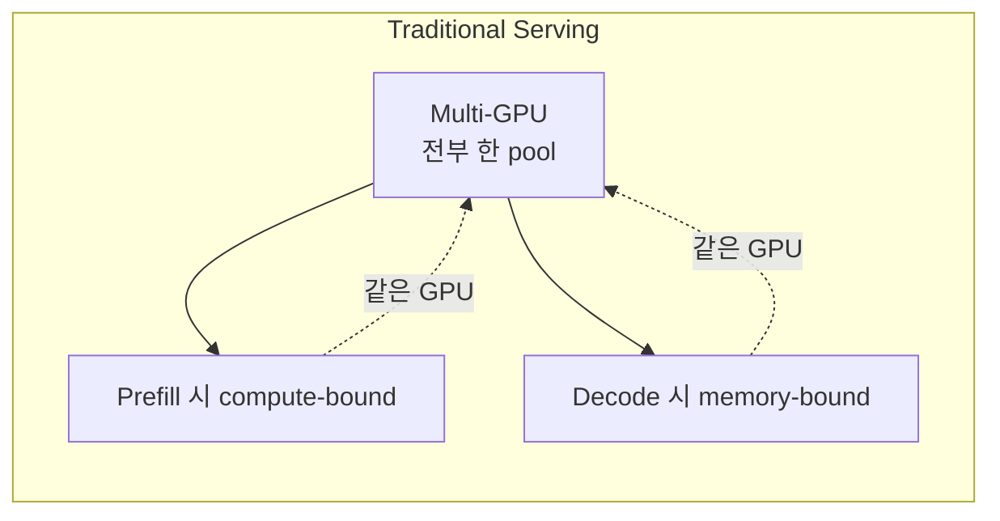

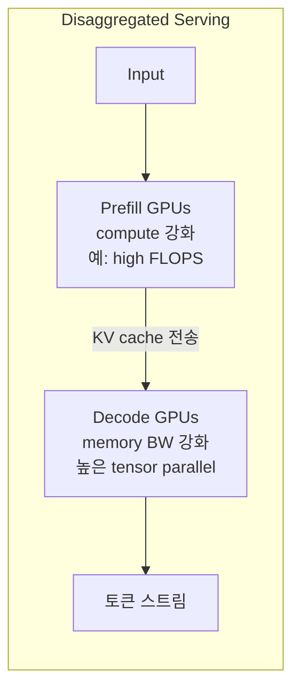

**왜 좋은가**:
- Prefill GPU는 batch 키워서 GEMM 효율 극대.
- Decode GPU는 tensor parallelism 키워서 메모리 대역폭 최대 활용.
- 서로 간섭 안 함 → 둘 다 효율 상승.

**효과**: Splitwise 1.4x throughput at -20% cost, DistServe **7.4x goodput** (같은 SLO 만족하는 throughput).

> **출처**: [DistServe paper (arXiv 2401.09670)](https://arxiv.org/abs/2401.09670), [Disaggregated Inference Retrospective (Hao AI)](https://haoailab.com/blogs/distserve-retro/)

### 5.4 NVIDIA Dynamo — 디스애그리게이션을 프로덕션화 ⭐

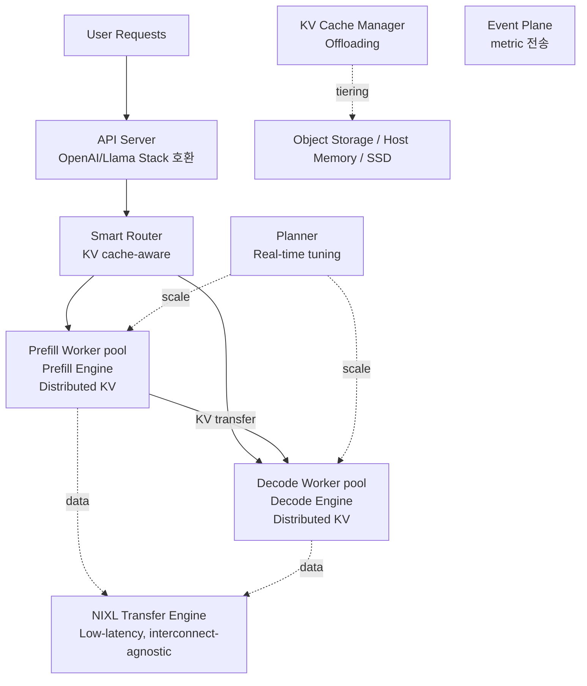

**핵심 컴포넌트**:
- **API Server**: 사용자/SDK가 보내는 OpenAI/Llama Stack 호환 요청 받음.
- **Smart Router**: KV cache가 어디 있는지 알고 거기로 라우팅 (insertion/eviction 알고리즘).
- **Disaggregated Serving**: Prefill Worker / Decode Worker 분리.
- **Planner**: 실시간 성능 모니터링으로 워커 개수 동적 조정.
- **KV Cache Manager**: GPU → Host RAM → SSD → Object Storage 4-tier offloading.
- **NIXL (NVIDIA Inference tranXfer Library)**: 노드 간 KV 전송용 저지연 라이브러리.
- **Event Plane**: 컴포넌트들 사이 메트릭 전달.

DeepSeek-R1을 Blackwell에서 돌릴 때 기존 대비 30x throughput.

> **출처**: [NVIDIA Dynamo 발표 블로그](https://developer.nvidia.com/blog/introducing-nvidia-dynamo-a-low-latency-distributed-inference-framework-for-scaling-reasoning-ai-models/), [Dynamo 아키텍처 문서](https://docs.nvidia.com/dynamo/latest/_sections/architecture.html)

### 5.5 Speculative Decoding — 작은 모델이 미리 찍고, 큰 모델이 검증

**왜 빠른가**: Decode가 memory-bound라 큰 모델은 매 step마다 메모리만 빨대로 빨고 컴퓨트는 놀음. 그러면 그 빈 컴퓨트를 활용해서 **여러 토큰을 한 번에 검증**하면 이득.

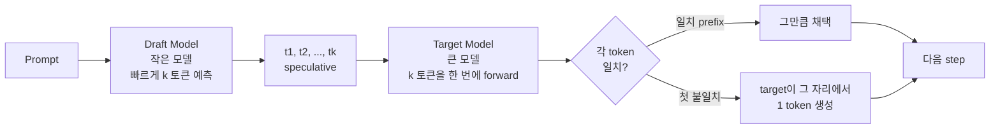

**보장**: 최종 토큰 분포는 target model이 직접 sampling한 것과 수학적으로 동일 → 품질 손실 0.

**관건**: draft가 얼마나 target과 비슷한가에 따라 acceptance rate가 결정 → 속도 향상은 2~3x 정도.

> **출처**: [Speculative Decoding (BentoML)](https://bentoml.com/llm/inference-optimization/speculative-decoding)

### 5.6 추론 서빙 생태계

| 도구 | 한 마디 |
|------|---------|
| **vLLM** | PagedAttention + Continuous batching. 가장 많이 씀. |
| **TensorRT-LLM** | NVIDIA가 최적화한 추론 엔진. 커널 수준 최적화. |
| **SGLang** | 구조화된 생성(JSON schema 등) 강함. |
| **Triton** | (1) NVIDIA Inference Server (2) Python-like GPU kernel DSL — 둘 다 Triton으로 불림. 헷갈리지 말기. |
| **LangChain** | Agent/chain orchestration (모델 호출이 아니라 흐름 관리). |
| **llm-d** | K8s 위에서 LLM 분산 서빙. |
| **Dynamo** | NVIDIA 차세대 disaggregated serving. Triton Server 후속. |

---

## Part 6. 분산 학습/추론과 인프라

### 6.1 4가지 병렬화 — 모델이 한 GPU에 안 들어갈 때

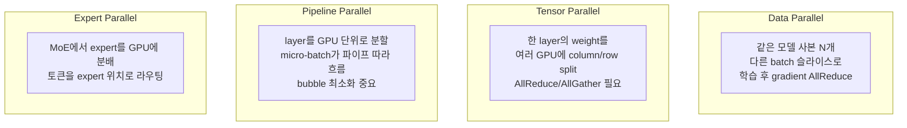

대규모 학습은 보통 이 4개를 **조합** (예: 3D parallelism = DP + TP + PP).

### 6.2 Collective Communication — GPU끼리 어떻게 데이터 교환하나

- **AllReduce**: 모든 GPU의 값을 합쳐서 모든 GPU에 같은 결과 (gradient sync).
- **AllGather**: 각 GPU의 조각을 모아서 모든 GPU에 전체 (tensor parallel 결과 합치기).
- **ReduceScatter**: AllReduce를 합 + scatter로 쪼갠 형태.
- **Broadcast**: 1개 GPU의 값을 모두에게.
- **All-to-All**: 각자 다른 데이터를 다른 곳으로 (MoE expert routing).

이걸 효율적으로 하려면 **토폴로지가 중요**. Ring, Tree, 2D mesh, NVSwitch all-to-all 등.

### 6.3 NVIDIA DGX SuperPOD — 데이터센터 한 통

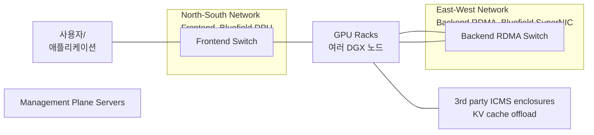

- **North-South** (사용자 ↔ 클러스터): Bluefield **DPU** (Data Processing Unit), Cloud Infrastructure Processor 역할.
- **East-West** (GPU ↔ GPU): Bluefield **SuperNIC** + NVLink/InfiniBand. 초고대역 저지연.
- **ICMS (Inference Context Management Storage)**: KV cache를 GPU/Host/SSD/Object storage 4단 tiering.

### 6.4 메모리 계층 (다시) — 추론 컨텍스트 입장에서

```
G1: GPU HBM       (ns)         ← 활성 KV
G2: Host DRAM     (10-100 ns)  ← spillover KV
G3: Local SSD     (us)         ← warm 컨텍스트 재사용
G4: Network Object Storage (ms)  ← cold 컨텍스트
```

NVMe-oF + NFSoRDMA + Bluefield로 **No-Copy RDMA path** (SSD → GPU 메모리 직접 전송).

---

## Part 7. AI 스케일링 법칙과 경제성

### 7.1 Scaling Laws — 모델을 얼마나 크게 만들어야 하나

**Kaplan (OpenAI, 2020)**: 모델이 클수록 좋다. 모델 크기를 우선 키워라.

**Chinchilla (DeepMind, 2022)** ⭐⭐: **모델과 데이터를 같이 키워야 한다**. 같은 compute budget이면 모델 크기 1/2, 데이터 2배가 더 좋다.

> 발견: **token / param ratio ~ 20** (학습 토큰 수가 모델 파라미터의 20배 정도일 때 compute-optimal)
> Chinchilla 70B (1.4T tokens) > Gopher 280B (300B tokens) — 같은 budget인데 작은 모델이 이김.

> **출처**: [Chinchilla Scaling Laws (GeeksforGeeks)](https://www.geeksforgeeks.org/artificial-intelligence/chinchilla-scaling-laws/), [Chinchilla in plain English (Life Architect)](https://lifearchitect.ai/chinchilla/)

**Llama 3 Moment (2024)**: 같은 70B 모델에 학습 토큰을 2T(Llama 2) → 15T(Llama 3)로. **추론 비용** 때문에 모델은 작게 유지, 학습 데이터로 품질 끌어올림.

→ 시대 변화: **The Era of Training → The Era of Inference**. 추론 비용이 학습 비용보다 더 중요해진 시대.

### 7.2 The Bitter Lesson — Sutton, 2019

> 70년 AI 연구의 교훈: **compute로 스케일하는 일반 방법**이 도메인 지식을 주입하는 접근법을 결국 이긴다.

**Two Key Principles**:
1. **Don't Teach. Incentivize.** — 지식을 직접 주입하지 말고, 목표·보상으로 유도하라.
2. **Scale Up.** — 대량 데이터, 대량 compute, 대량 모델.

**증거**: Vision Transformer vs CNN.
- ImageNet 규모(1M)에선 CNN(inductive bias 강함)이 우세.
- JFT-300M(300M) 규모에선 ViT가 CNN을 추월.
- → 데이터가 충분히 많으면 아키텍처에 박아둔 사전지식이 오히려 짐이 된다.

### 7.3 추론 경제학 — TCO와 TPM

```
TCO (Total Cost of Ownership)
  = 하드웨어 비용 + 운영 비용 + 전력 비용   (3-5년 보통)

TPM (Tokens Per Minute)
  = 한 AI 칩이 분당 생성하는 토큰 수
  = decoding throughput

Cost per token = TCO / TPM
```

서비스 사업자 관점: 사용자당 토큰을 1원에라도 싸게 뽑아야 한다. → 추론 최적화의 모든 노력은 결국 **TPM을 올리거나 TCO를 낮추는 것**.

---

## Part 8. Edge vs Cloud, HW-SW 디버깅

### 8.1 Edge vs Cloud 배포 비교

| 항목 | Edge | Cloud |
|------|------|-------|
| Latency | 매우 낮음 (local) | 네트워크 RTT 포함 |
| 모델 크기 | 작아야 함 (양자화 필수) | 큰 모델 가능 |
| 메모리 | LPDDR (저전력, 중대역) | HBM (고대역, 비쌈) |
| 전력 예산 | 매우 제한 (배터리/팬리스) | 데이터센터 PUE |
| 프라이버시 | 좋음 (데이터 외부로 안 나감) | 데이터 전송 필요 |
| 비용 모델 | 일회성 HW + 전기 | 사용량 기반 |
| 업데이트 | OTA 어려움 | 즉시 |
| 대표 사례 | 자율주행, 모바일 LLM, 공장 검사 | ChatGPT, Copilot |

**엣지에선 거의 필수**: 양자화(INT8/INT4) + KV cache 압축 + MQA/GQA + 모델 distillation.

### 8.2 HyperAccel/HyperDex 사례 — 가속기 SW 스택의 전형

```mermaid
flowchart TB
    APP[User Application<br/>Python/C/C++/OpenCL/Video/ML/Storage]
    LIB[Libraries and Tools<br/>Core API, Emulation, Profiler,<br/>Debugger, Board Tools, Virtualization]
    US[User Space<br/>xbutil, xbmgmt, xrt_core, libxlinxopencl, MPD/MSD]
    KER[Linux Kernel<br/>PCIe Drivers xocl xmgmt<br/>MPSoC Driver zocl<br/>Memory mgmt, DMA, Compiled image download]
    HWFW[HW and Firmware<br/>Platform shell, DMA engine, HW scheduler,<br/>Memory controller, Mailbox, Security/Firewall]
    DEV[Device<br/>UltraScale PCIe MB sched /<br/>MPSoC PCIe ARM sched /<br/>MPSoC Edge Device]
    APP --> LIB --> US --> KER --> HWFW --> DEV
```

**관찰**: AI 가속기는 ASIC만 만든다고 끝이 아니라, 위 모든 레이어가 같이 있어야 사용자가 쓴다. → HW-SW Co-design.

### 8.3 X-SIM 같은 Analytical Simulator의 디버깅 가치

엔지니어가 새 모델/새 batch/새 시퀀스 길이로 가속기 성능을 예측하고 싶을 때.

**Input**:
- Device (Bertha-Cloud / Edge)
- HuggingFace model ID
- Activation / Weight / KV dtype
- Batch size, sequence length
- Tensor parallel size

**Output**:
- Overall latency
- **TTFT (Time-To-First-Token)**
- **TBT (Time-Between-Tokens)**
- Tokens / second
- SRAM and DRAM peak usage

→ "이 모델이 우리 칩에서 돌면 어떤 성능 나올까?"를 RTL 없이 빠르게 답함.

### 8.4 ReAct/Agent 워크로드의 특징

```mermaid
flowchart LR
    P[Prefill<br/>Instruction] --> D1[Decode<br/>LLM thinks]
    D1 -- tool call --> TH[Tool History<br/>search/code/...]
    TH --> D2[Decode<br/>LLM continues]
    D2 -- tool call --> TH2[Tool History 2]
    TH2 --> D3[...]
```

특징: **KV cache가 무한히 자라는 경향**. tool 결과까지 다 context에 들어감 → 5장의 KV offloading(Dynamo의 KVCache Manager 같은 것)이 결정적.

---

## 부록 A. 1줄 요약 카드 30장

핵심을 한 줄씩.

1. **RISC** = 고정 워드, 단순 디코딩, 파이프라이닝 쉬움. LPU가 선택한 이유.
2. **VLIW** = 컴파일러가 병렬 슬롯 채움. ILP 풍부할 때만 유리.
3. **CISC** = 한 명령어가 복잡. x86. 가속기엔 안 맞음.
4. **Pipeline 5-stage** = IF / ID / EX / MEM / WB.
5. **Data hazard** = forwarding으로 해결, **Control hazard** = branch prediction.
6. **PPA** = Performance 상승, Power 감소, Area 감소 동시 만족 불가능.
7. **Behavioral / Functional / Analytical / Cycle-Accurate / Power-Area** 시뮬레이션.
8. **Event-driven simulation** = 매 cycle이 아닌 다음 event 시점으로 점프.
9. **Memory hierarchy**: Reg → L1 → L2 → L3 → SRAM → HBM/DRAM → SSD → Network.
10. **HBM** = 넓은 폭(1024-bit) 낮은 클럭, **GDDR** = 게이밍, **DDR/LPDDR** = 일반/엣지.
11. **Memory Wall**: 모델 410x/2년 vs DRAM BW 1.6x/2년 → 메모리 발목.
12. **Roofline**: 기울기=BW, 평탄=Peak. 왼쪽=BW-Limited, 오른쪽=Compute-Limited.
13. **Arithmetic Intensity**: matmul=2n, matvec=2. LLM decode=matvec=memory-bound.
14. **GPT-3 175B 5xH100 utilization = 0.3%** (메모리 BW가 발목).
15. **Prefill = compute-bound, Decode = memory-bound**.
16. **KV cache 공식**: 2·L·H_kv·d·S·B·bytes. Llama3.1 70B@128K = ~43GB/seq.
17. **MHA → GQA → MQA**: K/V head 줄여 KV 축소. **MLA**: latent로 압축, 품질 유지.
18. **RoPE** = 회전 행렬 위치 인코딩. **MoE** = expert 일부만 활성.
19. **양자화 비트**: FP32 > FP16/BF16 > FP8 > INT8 > INT4.
20. **W8/A8** = 정수 그대로, **W4/A16** = on-the-fly dequant 비용 고려.
21. **AWQ** = activation 큰 채널의 weight 보호 (per-channel scaling).
22. **vLLM PagedAttention** = KV cache를 page로 자르고 가상 메모리처럼 매핑. 낭비 제거 → batch 상승 → 2~4x throughput.
23. **Continuous Batching** = 매 step마다 batch 재구성.
24. **Disaggregation (Splitwise/DistServe)**: Prefill GPU pool과 Decode GPU pool 분리. 최대 7.4x goodput.
25. **NVIDIA Dynamo**: 위의 disaggregation을 프로덕션화. API Server, Smart Router, Planner, KV Cache Manager(4-tier offload), NIXL transfer engine.
26. **Speculative Decoding**: 작은 draft가 k 토큰 미리 → 큰 target이 한 번에 검증. 품질 동일, 2~3x 빠름.
27. **DGX SuperPOD**: North-South(Bluefield DPU), East-West(Bluefield SuperNIC + NVLink).
28. **Chinchilla**: 모델과 데이터를 같이 키워라. tokens/params ~ 20.
29. **Llama 3 Moment**: 학습 비용보단 추론 비용. 모델 작게, 데이터 많이.
30. **Cost per token = TCO / TPM**. 인프라 경제성의 핵심 지표.

---

## 부록 B. 약어 사전

| 약어 | 풀네임 | 한 마디 |
|------|--------|---------|
| ALU | Arithmetic Logic Unit | 덧셈·곱셈 등 산술 연산기 |
| ASIC | Application-Specific Integrated Circuit | 특정 용도 전용 칩 |
| BF16 | Brain Float 16 | FP16의 dynamic range를 늘린 16-bit float |
| CISC | Complex Instruction Set Computer | 명령어 풍부형 ISA |
| DSE | Design Space Exploration | 설계 공간 탐색 |
| DPU | Data Processing Unit | 네트워크/스토리지 처리 전용 (Bluefield) |
| FP16/32 | Floating Point 16/32 | IEEE-754 부동소수점 |
| GEMM | General Matrix-Matrix Multiplication | 행렬 곱셈 (BLAS Level 3) |
| GQA | Grouped-Query Attention | K/V head 그룹 공유 attention |
| HBM | High Bandwidth Memory | TSV로 stacked한 DRAM (1 TB/s급) |
| ICMS | Inference Context Management Storage | NVIDIA의 KV 캐시 tiering 인프라 |
| ILP | Instruction-Level Parallelism | 명령어 단위 병렬성 |
| ISA | Instruction Set Architecture | CPU가 알아듣는 명령어 집합 |
| KV | Key-Value | Attention의 K와 V 텐서 |
| LoRA | Low-Rank Adaptation | low-rank 미세조정 기법 |
| LPDDR | Low-Power DDR | 저전력 DDR (모바일·엣지) |
| LPU | LLM Processing Unit | HyperAccel의 가속기 |
| MAC | Multiply-Accumulate | 곱한 뒤 누적 (a + b*c) |
| MHA | Multi-Head Attention | 원조 Transformer attention |
| MLA | Multi-Head Latent Attention | DeepSeek의 latent-projected attention |
| MoE | Mixture of Experts | expert 일부만 활성 |
| MQA | Multi-Query Attention | K/V head 1개로 압축 |
| NIXL | NVIDIA Inference tranXfer Library | Dynamo의 데이터 전송 엔진 |
| OI | Operational Intensity (=Arithmetic Intensity) | ops/byte |
| OoO | Out-of-Order execution | 비순서 실행 |
| PE | Processing Element | 가속기의 기본 연산 셀 |
| PPA | Power, Performance, Area | 반도체 3대 trade-off |
| PPL | Perplexity | LM 품질 지표 (낮을수록 좋음) |
| RDMA | Remote DMA | CPU 거치지 않는 원격 메모리 접근 |
| RISC | Reduced Instruction Set Computer | 단순 명령어형 ISA |
| RoPE | Rotary Positional Embedding | 회전 위치 임베딩 |
| RTL | Register Transfer Level | HW 설계 추상화 수준 |
| SLO | Service Level Objective | 목표 응답시간 등 |
| SoC | System on Chip | 한 칩에 여러 모듈 |
| SRAM | Static RAM | 칩 내부 빠른 메모리 |
| TBT | Time Between Tokens | decode 1 토큰당 시간 |
| TCO | Total Cost of Ownership | 총 소유 비용 |
| TPM | Tokens Per Minute | 분당 토큰 생성량 |
| TSV | Through-Silicon Via | HBM 적층 연결 기술 |
| TTFT | Time To First Token | prefill 끝나서 첫 토큰 나올 때까지 |
| VLIW | Very Long Instruction Word | 컴파일러 정적 ILP ISA |
| vLLM | (Virtual LLM) | PagedAttention 기반 서빙 엔진 |

---

## 출처 (이 노트에서 인용한 문서들)

- ISA 일반: [RISC vs CISC (GeeksforGeeks)](https://www.geeksforgeeks.org/computer-organization-architecture/computer-organization-risc-and-cisc/), [VLIW Microprocessors (Computerworld)](https://www.computerworld.com/article/1368853/vliw-microprocessors.html)
- Pipeline: [MIPS Pipelining 강의노트 (Cooper Union)](https://ee.cooper.edu/~curro/comparch/pipeline/chapter4_pipelining_END_FA11.pdf)
- Roofline: [Roofline Model (Wikipedia)](https://en.wikipedia.org/wiki/Roofline_model), [NERSC Roofline](https://docs.nersc.gov/tools/performance/roofline/), [Roofline (Modal GPU Glossary)](https://modal.com/gpu-glossary/perf/roofline-model)
- Memory: [HBM vs DDR (intuitionlabs)](https://intuitionlabs.ai/pdfs/hbm-vs-ddr-key-differences-in-memory-technology-explained.pdf), [GDDR vs HBM (FiberMall)](https://www.fibermall.com/blog/gddr-hbm.htm)
- KV cache 계산: [KV Cache Memory Calculation (Lyceum)](https://lyceum.technology/magazine/kv-cache-memory-calculation-llm/)
- Attention 변형: [DeepSeek-V2 paper (arXiv 2405.04434)](https://arxiv.org/abs/2405.04434), [MLA (Sebastian Raschka)](https://sebastianraschka.com/llm-architecture-gallery/mla/)
- AWQ: [AWQ paper (arXiv 2306.00978)](https://arxiv.org/abs/2306.00978), [MIT HanLab AWQ](https://hanlab.mit.edu/projects/awq)
- PagedAttention/vLLM: [vLLM paper (arXiv 2309.06180)](https://arxiv.org/pdf/2309.06180), [PagedAttention (Red Hat)](https://developers.redhat.com/articles/2025/07/24/how-pagedattention-resolves-memory-waste-llm-systems)
- Disaggregation: [DistServe paper (arXiv 2401.09670)](https://arxiv.org/abs/2401.09670), [Disaggregated Inference (Hao AI Lab)](https://haoailab.com/blogs/distserve-retro/)
- NVIDIA Dynamo: [Dynamo 발표 블로그](https://developer.nvidia.com/blog/introducing-nvidia-dynamo-a-low-latency-distributed-inference-framework-for-scaling-reasoning-ai-models/), [Dynamo 공식 문서](https://docs.nvidia.com/dynamo/latest/_sections/architecture.html)
- Speculative decoding: [Speculative Decoding (BentoML)](https://bentoml.com/llm/inference-optimization/speculative-decoding)
- Chinchilla: [Chinchilla Scaling Laws (GeeksforGeeks)](https://www.geeksforgeeks.org/artificial-intelligence/chinchilla-scaling-laws/), [Chinchilla in plain English (Life Architect)](https://lifearchitect.ai/chinchilla/)

---

## 이미지 출처 (Image Attributions)

이 노트의 모든 이미지는 Creative Commons 라이선스 또는 Public Domain으로 공개된 자료입니다. 라이선스 조건에 따라 출처와 저작자를 명시합니다.

| 파일 | 출처 페이지 | 저작자 | 라이선스 |
|------|------------|--------|----------|
| `von_neumann.svg` | [Wikimedia Commons](https://commons.wikimedia.org/wiki/File:Von_Neumann_Architecture.svg) | Kapooht | CC BY-SA 3.0 |
| `pipeline_5stage.png` | [Wikimedia Commons](https://commons.wikimedia.org/wiki/File:Fivestagespipeline.png) | Inductiveload | Public Domain |
| `memory_hierarchy.svg` | [Wikimedia Commons](https://commons.wikimedia.org/wiki/File:ComputerMemoryHierarchy.svg) | User:Danlash / Fred the Oyster | Public Domain |
| `hbm_stack.svg` | [Wikimedia Commons](https://commons.wikimedia.org/wiki/File:High_Bandwidth_Memory_schematic.svg) | Shigeru23 | CC BY-SA 3.0 |
| `roofline.svg` | [Wikimedia Commons](https://commons.wikimedia.org/wiki/File:Example_of_a_Roofline_model.svg) | Giu.natale | CC BY-SA 4.0 |
| `transformer_arch.png` | [Wikimedia Commons](https://commons.wikimedia.org/wiki/File:Transformer,_full_architecture.png) | (Wikipedia contributors) | CC BY-SA |
| `transformer_block.png` | [Wikimedia Commons](https://commons.wikimedia.org/wiki/File:Transformer,_one_encoder-decoder_block.png) | (Wikipedia contributors) | CC BY-SA |
| `attention_block.png` | [Wikimedia Commons](https://commons.wikimedia.org/wiki/File:Transformer,_attention_block_diagram.png) | (Wikipedia contributors) | CC BY-SA |
| `multihead_attention.png` | [Wikimedia Commons](https://commons.wikimedia.org/wiki/File:Multiheaded_attention,_block_diagram.png) | (Wikipedia contributors) | CC BY-SA |
| `deepseek_moe_mla.svg` | [Wikimedia Commons](https://commons.wikimedia.org/wiki/File:DeepSeek_MoE_and_MLA_(DeepSeek-V2).svg) | (Wikipedia contributors) | CC BY-SA |

CC BY-SA 라이선스: 동일한 조건으로 재배포 가능. 자세한 조건은 각 라이선스 페이지 참조 ([CC BY-SA 3.0](https://creativecommons.org/licenses/by-sa/3.0/), [CC BY-SA 4.0](https://creativecommons.org/licenses/by-sa/4.0/)).
