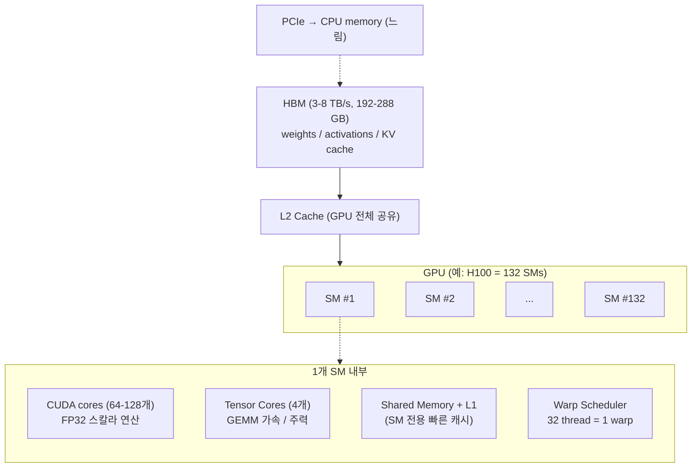

# FLOPS와 Device Utilization

> Ch 1에서 책이 "FLOPS와 device utilization은 misleading하다"고 한 이유. 두 지표가 정확히 무엇을 말하고, 왜 못 믿는가.

## Quick Reference - GPU 용어 (이 노트에서 자주 등장)

자세한 설명은 책 Ch 6 이후. 여기선 이 노트 이해에 필요한 정도만.

- **SM (Streaming Multiprocessor)**: GPU 안의 기본 처리 단위. CPU의 코어 같은 것. H100=132개, B200=148개. 한 SM 안에 CUDA core + Tensor Core + shared memory + warp scheduler가 모두 들어있음.
- **CUDA core**: SM 안의 기본 FP32 스칼라 계산 유닛. 한 SM에 64-128개. 전통 그래픽/일반 연산 담당.
- **Tensor Core**: SM 안의 **행렬 곱셈(GEMM) 전용 가속 유닛**. 작은 matrix multiply를 한 사이클에 수행. AI 학습/추론에서 실제 일하는 주력. FP16/BF16/FP8/FP4 같은 reduced precision일수록 압도적으로 빠름. Volta(V100)에 도입, Hopper의 Transformer Engine, Blackwell로 진화.
- **Warp**: 32개 thread가 묶여 같은 instruction을 동시에 실행 (SIMT). SM은 warp 단위로 스케줄링.
- **HBM (High Bandwidth Memory)**: GPU 칩 옆에 적층된(stacked) DRAM. 매우 빠른 대역폭 (3-8 TB/s). 모델 weights / activations / KV cache 가 모두 여기에 들어감. 현재 GPU당 용량 상한은 192-288 GB.
- **DRAM / "memory" 와의 관계**: GPU에서 "메모리"라 하면 거의 HBM. CPU의 main memory와 별개. PCIe를 통해 CPU와 GPU 사이 데이터 이동이 일어남 (느림).

### GPU 내부 구조 (모식도)



(thread → warp(32 thread) → block → grid 계층은 책 Ch 6에서 자세히)

## FLOPS

### 정의

- **FLOP** = floating point operation. 부동소수점 연산 1회 (덧셈 1번, 곱셈 1번, FMA(fused multiply-add)는 보통 2 FLOPs로 카운트)
- **FLOPS** = FLOPs per second. 초당 부동소수점 연산 횟수
- 표기 혼란 주의: FLOP은 단위 작업, FLOPS는 처리율. 둘 다 대문자 S로 끝나서 헷갈림

### 단위 스케일

| 약자 | 값 |
|---|---|
| GFLOPS | 10^9 |
| TFLOPS | 10^12 |
| PFLOPS | 10^15 |
| EFLOPS | 10^18 |

### 부동소수점 정밀도 종류 (FP64, FP32, FP16, BF16, FP8, FP4)

모든 부동소수점은 IEEE 754(또는 그 확장) 구조로 세 부분:

- **Sign (1 bit)**: 양수/음수
- **Exponent**: 표현 가능한 값의 범위 (얼마나 크고 작은 수까지)
- **Mantissa (fraction)**: 정밀도 (유효 숫자 자릿수)

비트가 많을수록 정밀+범위 ↑, 적을수록 메모리/속도/대역폭 ↑. AI 학습/추론은 약간의 수치 손실이 허용되므로 **reduced precision** 추세.

#### 포맷별 구조

| 포맷 | 총 비트 | Sign | Exp | Mantissa | 표현 범위 | 정밀도 |
|---|---:|---:|---:|---:|---|---|
| FP64 (double) | 64 | 1 | 11 | 52 | ~1.8e308 | ~15-17 자리 |
| FP32 (single, "float") | 32 | 1 | 8 | 23 | ~3.4e38 | ~7 자리 |
| TF32 (NVIDIA, Ampere+) | 19 (저장은 32) | 1 | 8 | 10 | FP32와 동일 | ~3 자리 |
| BF16 (bfloat16) | 16 | 1 | 8 | 7 | FP32와 동일 | ~2-3 자리 |
| FP16 (half) | 16 | 1 | 5 | 10 | ~6.5e4 | ~3-4 자리 |
| FP8 E4M3 | 8 | 1 | 4 | 3 | ~448 | 매우 낮음 |
| FP8 E5M2 | 8 | 1 | 5 | 2 | ~57344 | 매우 낮음 |
| FP4 (E2M1 등) | 4 | 1 | 2 | 1 | 매우 좁음 | 매우 낮음 |

FP8/FP4는 IEEE 754 표준 외. NVIDIA / Open Compute Project 등이 정의 (예: Blackwell의 microscaling MXFP4).

비트 배치 비교 (시각):

```
FP32 (32-bit):  S | EEEEEEEE | MMMMMMMMMMMMMMMMMMMMMMM
                1 |    8     |          23

BF16 (16-bit):  S | EEEEEEEE | MMMMMMM           <- FP32와 같은 exponent 폭
                1 |    8     |    7

FP16 (16-bit):  S | EEEEE | MMMMMMMMMM           <- mantissa 더 많지만 range 좁음
                1 |   5   |    10

FP8 E4M3:       S | EEEE | MMM
                1 |   4  |   3

FP8 E5M2:       S | EEEEE | MM                   <- range 우선, 정밀 더 낮음
                1 |   5   |  2

FP4 (E2M1):     S | EE | M
                1 |  2 | 1
```

(가독성을 위해 칸 너비는 실제 비트 비율과 다소 다름)

#### 어떤 용도에 어떤 정밀도

| 용도 | 권장 정밀도 |
|---|---|
| HPC 시뮬레이션 (정확도 critical) | FP64 |
| 전통 ML 학습 (안전 baseline) | FP32 |
| 현대 LLM 학습 (사실상 표준) | **BF16** (loss scaling 불필요) |
| 학습 mixed precision (옛 방식) | FP16 (loss scaling 필요) |
| Ampere+에서 FP32 코드 자동 가속 | TF32 (FP32 호출 그대로 두면 자동) |
| Hopper+ 학습/추론 | FP8 |
| Blackwell+ 추론 | FP4 |
| 추론 quantization (FP 아님) | INT8 (GPTQ/AWQ 등) |

#### BF16 vs FP16 (자주 헷갈림)

- **FP16**: mantissa 10 bit로 정밀하지만 exponent 5 bit라 **range 좁음**. gradient가 작아지면 underflow -> **loss scaling 기법 필요**.
- **BF16**: mantissa 7 bit로 덜 정밀하지만 exponent 8 bit (FP32와 동일)라 **range 넓음**. loss scaling 불필요. NVIDIA Ampere부터 Tensor Core 지원. 현대 LLM 학습 사실상 표준.

#### 왜 reduced precision인가

- **메모리**: 100B 모델 weights를 FP32면 400 GB, BF16이면 200 GB, FP8이면 100 GB. HBM 용량 제한 안에 더 큰 모델 들어감.
- **속도**: Tensor Core가 reduced precision일수록 더 많은 연산. B200 FP8은 FP16의 2배, FP4는 FP8의 2배.
- **대역폭**: HBM->GPU 데이터 전송 시 비트 적을수록 빠름. memory-bound 워크로드 (예: LLM decode)에서 결정적.
- **trade-off**: 너무 줄이면 학습 발산 / 추론 품질 저하. mixed precision (계산은 low, master weights는 FP32) 또는 quantization-aware training 같은 기법 필요.

### 정밀도에 따라 FLOPS가 다르다

같은 GPU도 데이터 타입별 peak가 다름. Tensor Core는 reduced precision일수록 빠름.

| GPU | FP64 | FP32 | FP16/BF16 | FP8 | FP4 |
|---|---:|---:|---:|---:|---:|
| H100 SXM | 67 TFLOPS | 67 TFLOPS | 989 TFLOPS | 1979 TFLOPS | - |
| B200 | 40 TFLOPS | 80 TFLOPS | 2.25 PFLOPS | 4.5 PFLOPS | 9 PFLOPS |
| GB200 NVL72 (72 GPU) | - | - | 180 PFLOPS | 360 PFLOPS | 1.44 EFLOPS (2:1 sparse) |

(2:1 structured sparsity는 가중치 중 절반이 0이라고 가정하고 곱셈을 절반만 하는 트릭. dense FLOPS의 2배로 보고됨)

### 왜 misleading한가

- 카탈로그 FLOPS는 "**이론적 peak**" - 모든 SM이 동시에, Tensor Core 100% 채워서, 메모리 stall 없이 작동했을 때
- 실제 코드는 거의 도달 못 함. 이유:
  - 메모리 bandwidth 한계 (HBM에서 데이터 못 갖고 옴)
  - kernel launch overhead
  - 동기화 / barrier
  - 통신 (NCCL all-reduce 등) 동안 GPU idle
  - branching, 비효율적 access pattern
- Llama 405B를 H100에서 학습 시 MFU 38-43%, DeepSeek-V3는 ~50% MFU 보고. 즉 카탈로그의 절반 안 됨

## Device Utilization

### `nvidia-smi`의 "GPU-Util" 또는 NVML/DCGM의 utilization

#### 정의 (가장 흔한 함정)

- 지난 sampling interval(보통 1초 또는 100ms) 동안 GPU에서 **하나 이상의 kernel이 실행 중이었던 시간 비율**
- 다시 말해: "GPU가 일을 하고 있었나 idle이었나"의 매우 거친 binary 합산

#### 왜 misleading한가

- 1ms 짜리 kernel을 100ms마다 launch하면? -> kernel은 1% 시간만 쓰지만 sampling interval 안에서 measure하면 100% util로 보고될 수 있음
- 더 나쁜 경우: kernel이 메모리 stall로 99% 대기 중이어도 "실행 중"으로 카운트됨 -> 실제 SM은 idle인데 util은 100%
- 책 본문 인용: "device utilization is misleadingly high, as much of the time is likely spent on stalled communication, idling computation, or failed job restarts"

### 더 신뢰할 만한 sub-metric (DCGM)

| DCGM 메트릭 | 의미 | 목표 값 |
|---|---|---|
| `DCGM_FI_DEV_GPU_UTIL` | nvidia-smi와 동일. **거친 지표** | - |
| `DCGM_FI_PROF_SM_ACTIVE` | SM이 활성 상태였던 비율 | 높을수록 좋음 |
| `DCGM_FI_PROF_SM_OCCUPANCY` | active SM에서 warp 점유율 | 50%+ |
| `DCGM_FI_PROF_PIPE_TENSOR_ACTIVE` | Tensor Core 사용 비율 | 학습/추론에서 60%+ 이상이면 좋음 |
| `DCGM_FI_PROF_DRAM_ACTIVE` | HBM 메모리 컨트롤러 활성 비율 | 패턴 따라 다름. memory-bound면 90%+ |
| `DCGM_FI_PROF_PCIE_TX_BYTES` / `_RX_BYTES` | PCIe 트래픽 | - |
| `DCGM_FI_PROF_NVLINK_TX_BYTES` / `_RX_BYTES` | NVLink 트래픽 | - |

`DCGM_FI_PROF_*` 시리즈가 진짜 실행 패턴을 보여줌. `DEV_GPU_UTIL`만 보고 "GPU가 일하고 있다"고 결론 내면 안 됨.

## MFU vs HFU

추가로 학계/산업계에서 쓰는 더 honest한 두 지표:

- **MFU (Model FLOPs Utilization)** = 모델 정의로부터 계산한 "있어야 할" FLOPs / peak FLOPS
- **HFU (Hardware FLOPs Utilization)** = 실제로 실행된 FLOPs (recompute, masked attention 포함) / peak FLOPS
- 보통 MFU < HFU (HFU는 redundant compute 포함)
- 둘 다 보고하면 "이 모델이 시스템을 얼마나 잘 활용하나" + "구현 오버헤드가 얼마나 되나" 분리 가능

## 응용/적용 아이디어

- 클러스터 모니터링 대시보드에서 `DEV_GPU_UTIL` 단독 차트는 함정. `PROF_SM_ACTIVE`, `PROF_PIPE_TENSOR_ACTIVE` 추가 패널 필요.
- Failure 직전 상태 진단 시: util 100%인데 throughput이 낮으면 SM stall 의심. PROF metric 함께 보면 원인 분리 가능.
- 학습 작업 efficiency 보고 시 MFU와 ETTR을 함께 표기하면 "GPU 활용도"와 "시스템 신뢰성"이 분리되어 명확해짐.

## 한 줄 요약

- FLOPS = 이론적 처리율 상한선. 실제는 30-50%만 도달
- Device utilization (GPU-Util) = "kernel이 떠 있었나" 정도. SM이 진짜 일하는지 모름
- 진짜 알고 싶으면: `DCGM_FI_PROF_SM_ACTIVE`, `DCGM_FI_PROF_PIPE_TENSOR_ACTIVE`, MFU
