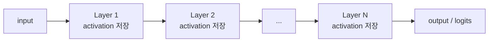
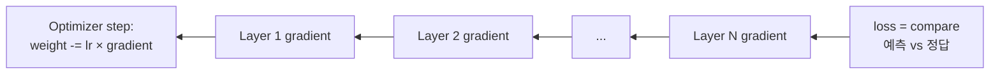

# Training Basics - Forward / Backward / Chain Rule / 회계

> 책 전체에 깔린 기초. "왜 학습이 추론보다 5-6배 메모리를 쓰는가", "왜 backward가 forward의 2배인가", "왜 reduced precision은 학습에 위험한가"의 공통 답.

## Forward / Backward 흐름

### Forward pass = "예측 계산"

입력 → 모델 → 출력. 학습/추론 둘 다 필요한 단계.



각 layer의 출력(activation)은 메모리에 **저장**. backward에서 chain rule 적용 시 필요.

추론은 여기서 끝. activation도 KV cache 외엔 즉시 버려도 됨.

### Backward pass = "오차로부터 gradient 계산" (학습만)



각 layer에서 **두 가지를 계산**해야 함:
1. **이 layer의 weight gradient**: weight를 얼마나 바꿔야 하나
2. **앞 layer로 보낼 gradient**: chain rule로 계속 전파

### 학습 1 step 전체

```
Forward → Loss 계산 → Backward → Optimizer step → 다음 batch
```

## Chain Rule = "비율의 곱셈"

### 일상 비유

- A가 1 바뀌면 B는 **2배** 변한다
- B가 1 바뀌면 C는 **3배** 변한다
- → A가 1 바뀌면 C는 **2 × 3 = 6배** 변한다

수학 표기로:
```
∂C/∂A = ∂C/∂B × ∂B/∂A = 3 × 2 = 6
```

∂(부분미분) = "한 변수만 살짝 바꿨을 때 다른 변수가 얼마나 변하나"의 비율.

### 신경망 적용

```
input → Layer1 → Layer2 → ... → LayerN → output → loss
```

학습이 알고 싶은 것: **"Layer k의 weight를 살짝 바꾸면 loss가 얼마나 변할까?"** (그 비율만큼 weight 조정).

```
∂loss/∂W_k = ∂loss/∂output × ∂output/∂Layer_N × ... × ∂Layer_{k+1}/∂W_k
                          ↑
                  모든 단계의 비율을 곱함
```

뒤에서 앞으로 흘려보내며 계산 → **backward pass**.

## Vanishing / Exploding Gradient

### Vanishing = "비밀 전달 게임"

100명이 줄지어 비밀을 전달:
- 각자 **60%만 정확히** 전달
- 다음 사람: 0.6
- 그 다음: 0.6² = 0.36
- ...
- 100번째: 0.6¹⁰⁰ ≈ **거의 0**

100층 신경망의 첫 layer gradient도 똑같이 됨. **0에 수렴 → weight 업데이트 안 됨 → 학습 정지**.

FP16에선 underflow까지 더해져서 진짜로 0이 됨. **BF16/FP32의 넓은 range가 필수**인 이유.

### Exploding = "메아리가 자라남"

각 layer 영향이 1보다 크면 반대:
- 1.5¹⁰⁰ ≈ 4 × 10¹⁷
- gradient 폭발 → weight가 NaN/Inf → 학습 발산

### 해결책 (간략)

| 기법 | 효과 |
|---|---|
| ResNet skip connection | gradient에 "지름길" 제공, 곱셈 누적 감소 |
| BatchNorm / LayerNorm | activation 분포 정규화 |
| Gradient clipping | gradient 폭발 시 max norm으로 자름 |
| 좋은 초기화 (Xavier, Kaiming) | 처음부터 적정 분산 유지 |
| BF16 정밀도 | range 넓어 underflow 회피 (FP16 대비) |

## FLOPs 회계 (왜 6 × params × tokens?)

### Forward = 2 × params × tokens

LLM 핵심 연산은 **행렬 곱셈**. token 한 개가 layer 통과 시:

```
출력 = weight 행렬 × 입력 + bias
```

weight 1개당:
- 곱셈 1번 (token × weight)
- 덧셈 1번 (앞 결과에 더하기)
- → **2 FLOPs**

전체 = 모든 token이 모든 weight 거침 → **2 × params × tokens**

비유: 손님 1만 명(tokens) × 메뉴 100개(params) × 2 연산(곱+덧) = 2,000,000 회계 처리.

### Backward = 4 × params × tokens (forward의 2배)

Backward는 **두 가지를 동시에**:
1. 이 layer의 **weight gradient** (행렬 곱셈 1번)
2. 앞 layer로 보낼 **입력 gradient** (행렬 곱셈 또 1번)

각각이 forward와 같은 크기 → 2배 비용.

비유: 영수증 1장 작성(forward) → 영수증 검증 + 원인 분석(backward) = 작업량 3배.

### 합계 = 6 × params × tokens

학습 1 step = forward + backward = 2 + 4 = **6 × params × tokens FLOPs**.

추론은 forward만 → **2 × params × tokens FLOPs** (학습의 1/3).

### 예시 계산

Llama-3 405B를 1T tokens 학습:
```
6 × 405e9 × 1e12 = 2.43e24 FLOPs = 2.43 ZettaFLOPs
H100 BF16 peak = 989 TFLOPS
이론 시간 = 2.43e24 / 989e12 = 2.46e9 초 = 78 GPU-년 (단일 GPU 가정)
실제: 16K H100, ~60일 = 297 GPU-년
MFU ≈ 78 / 297 ≈ 26% (공개값 38-43%, 책 추정과 근사)
```

## 학습 메모리 회계 (왜 5-6× weights?)

학습 중 GPU에 들고 있어야 할 것:

| 항목 | 크기 | 설명 |
|---|---|---|
| **Weights** | W | 모델 본체 |
| **Gradient** | W | 각 weight에 대한 ∂loss/∂w |
| **Optimizer state** | 2W (Adam) | 1차/2차 모멘트 (m, v) |
| **Activation** | 0.5W ~ 2W | forward 결과 임시 저장, batch/seq에 비례 |
| **합계** | **~4.5W~6W** | |

### 책 비유

- **Weights = 책 본체** (1권)
- **Gradient = 같은 두께 노트** (페이지마다 수정 메모) (1권)
- **Optimizer state = 또 두 권 노트** (학습 이력 두 종류) (2권)
- **Activation = 작업 메모지** (forward 결과 임시) (0.5-2권)
- 합계: **책 5-6권 분량**

### Optimizer state 종류별

| Optimizer | State 크기 |
|---|---|
| SGD | 0 |
| SGD + Momentum | 1W |
| **Adam / AdamW** (가장 흔함) | **2W** |
| Adafactor | 줄임 (LLM용) |
| 8-bit Adam (bitsandbytes) | 0.25W ~ 0.5W |

### 추론 메모리

추론은:
- ✓ Weights
- ✗ Gradient 없음
- ✗ Optimizer state 없음
- 매우 작은 activation (현재 token만)
- + KV cache (이전 token들의 attention key/value)

→ **weights + KV cache** 정도. 학습 대비 1/5~1/6.

## 모델 분산이 왜 필요한가

100B 모델을 BF16으로:
- weights = 200 GB (단일 GPU HBM 192-288 GB에 겨우 들어감)
- 학습 메모리 = 200 × 5 ≈ **1 TB**
- H100 1대(80GB)는 물론 1000 GB 노드(8 × H100)에도 안 들어감

→ **모델을 여러 GPU에 쪼개야 함**. Track:
- **DP (Data Parallel)**: 모델 전체 복제, 다른 batch (메모리 절감 X)
- **FSDP**: weights/gradient/optimizer state도 GPU에 sharding (5-6배 메모리 → 1/N로)
- **TP (Tensor Parallel)**: 단일 layer 안 행렬을 분할
- **PP (Pipeline Parallel)**: layer를 GPU별로 분리
- **EP (Expert Parallel)**: MoE expert를 분산
- 보통 hybrid (예: FSDP + TP + PP)

책 Ch 13-14에서 본격 다룸.

## 정밀도 코드 결정 방법 (PyTorch)

```python
# 방법 1: 모델 dtype 직접 변경
model = model.bfloat16()                  # BF16

# 방법 2: Hugging Face 로드 시
model = AutoModelForCausalLM.from_pretrained(
    "...", torch_dtype=torch.bfloat16,
)

# 방법 3: Mixed precision (학습 표준)
with torch.autocast(device_type="cuda", dtype=torch.bfloat16):
    output = model(input)                 # forward는 BF16
loss.backward()                           # gradient는 FP32 (master weights)

# 방법 4: 추론 quantization (FP8 / INT8 / FP4)
# bitsandbytes, AWQ, GPTQ 등
model = AutoModelForCausalLM.from_pretrained(
    "...", load_in_4bit=True,
)
```

자동 가속:
- **TF32**: Ampere+에서 FP32 호출이 자동으로 19비트 TF32로 가속
- **FP8 (Transformer Engine)**: H100+에서 라이브러리가 scale factor 자동 관리

## 응용/적용 아이디어

- 학습 작업 GPU 메모리 계산 시 **5-6× weights** 어림 (정확한 값은 batch / seq / optimizer 종류에 의존)
- "왜 이 모델이 OOM 나는가" 진단 시 4가지 항목 (weights/gradient/optimizer/activation) 각각 추정
- BF16/FP16 학습이 발산할 때 vanishing/exploding gradient 검토 → loss scaling, gradient clipping
- 추론 비용 추정: tokens × 2 × params (FLOPs), weights + KV cache (메모리)
- 학습/추론 메모리 차이가 5-6배라는 점 → 추론은 작은 클러스터로 가능, 학습은 대규모 클러스터 필요

## 한 줄 요약

- **Chain rule**: 단계별 비율의 곱셈. 깊을수록 vanishing 또는 exploding 위험.
- **FLOPs**: forward 2W·T, backward 4W·T → 학습 1 step = 6W·T. 추론은 2W·T.
- **메모리**: 학습 ≈ 책 5-6권 (W + W + 2W + activation), 추론 ≈ 1W + KV cache.
- **정밀도**: 코드에서 dtype 명시. mixed precision이 학습 표준. 추론은 quantization 공격적 가능.

## Open Questions / 추가 확인

- Backward가 forward의 정확히 2배인지, 모델 구조에 따라 어떻게 달라지는지 (attention의 quadratic 비용 등 책 Ch 6-12에서 다룰 듯)
- Activation 메모리 추정 공식 (batch × seq × hidden × layer 등). 책 Ch 13 PyTorch profiler 섹션에서 본격
- Recompute / gradient checkpointing이 memory-FLOPs trade-off에 어떻게 들어맞는지 (Ch 13)
