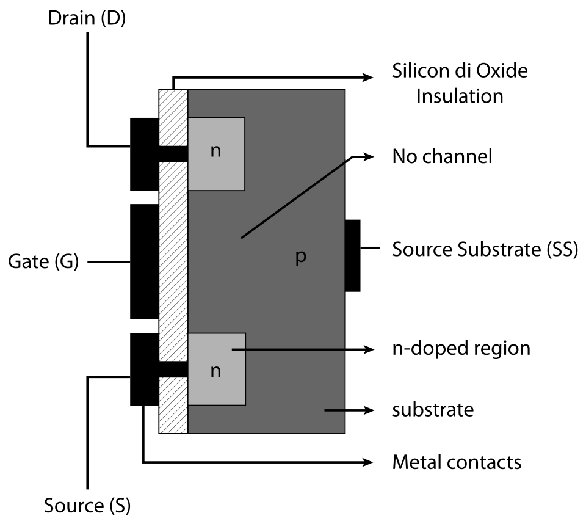
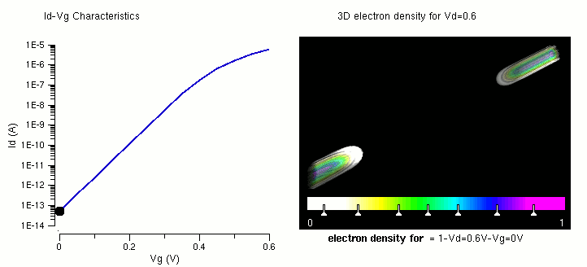
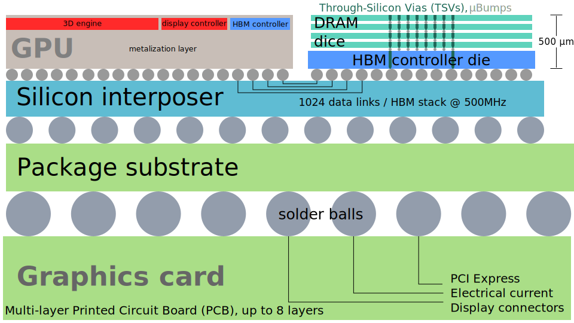
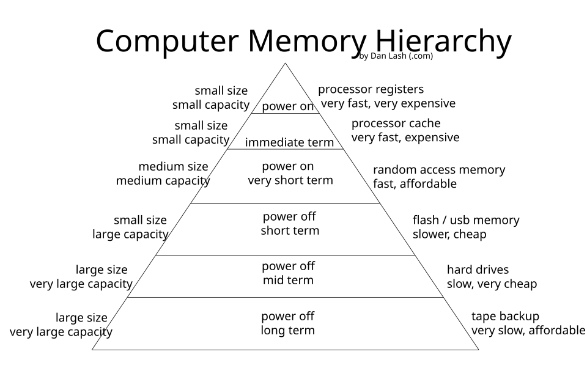
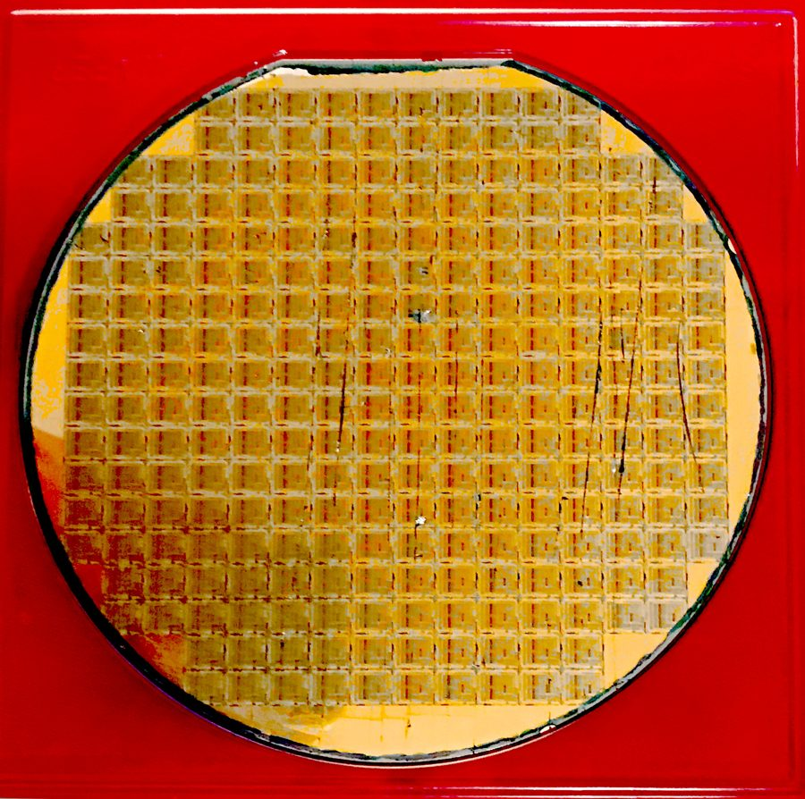
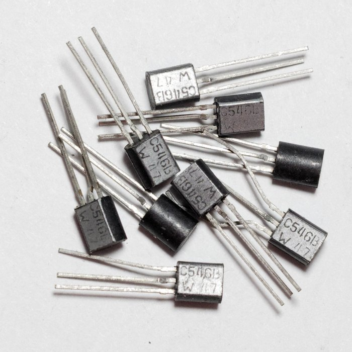
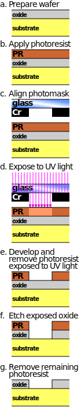

# 00 — 반도체 소자 기초 (Semiconductor Device Basics)

> 목표: 회로를 몰라도 "반도체 회사가 대체 뭘 만들고, 설계가 뭘 하는지" 감 잡기.

---

## 1. 반도체(Semiconductor)가 뭔가

**도체**는 전기가 잘 통한다(구리). **부도체**는 안 통한다(고무). **반도체**는 그 중간인데, 핵심은 이거다:

> **조건에 따라 전기를 통하게 했다가(1) 막았다가(0) 할 수 있다.**

이 "켰다 껐다"가 바로 디지털 0과 1이다. 반도체의 대표 재료가 **실리콘(Si)**이고, 여기에 불순물을 살짝 섞으면(도핑) 전기 성질을 조절할 수 있다.

- **N형**: 전자(-)가 많은 실리콘
- **P형**: 전자가 부족한(정공 +) 실리콘

이 N형과 P형을 조합해서 **트랜지스터**라는 스위치를 만든다. 이게 모든 반도체의 출발점이다.

---

## 2. 트랜지스터 = 전기로 켜고 끄는 스위치

트랜지스터는 **"전압으로 여닫는 수도꼭지"**라고 생각하면 된다. 물(전류)이 흐르는 통로가 있고, 손잡이(게이트)에 전압을 주면 통로가 열려 전류가 흐른다.

가장 많이 쓰는 게 **MOSFET**이다. 단자가 3개다:

- **Gate(G, 게이트)**: 손잡이. 여기에 전압을 준다.
- **Source(S, 소스)**: 전류가 들어오는 곳
- **Drain(D, 드레인)**: 전류가 나가는 곳


*MOSFET 단면(회색조 도식). 연한 회색 두 블록이 N도핑 영역(Source/Drain), 진한 회색이 P기판. Gate에 전압이 없으면 두 N영역 사이가 끊겨 있어(그림에 "No channel"로 표시) 전류가 안 흐른다. 출처: Wikimedia `N-channel enhancement-type MOSFET.svg`*

Gate에 충분한 전압(Vth, 문턱전압)을 주면, Gate 바로 아래 P영역에 전자가 모여 **채널(길)**이 생기고 Source→Drain으로 전류가 흐른다 = **ON**. 전압을 빼면 채널이 사라진다 = **OFF**.


*TCAD(소자 시뮬레이션) 결과. 왼쪽: 게이트 전압(Vg)을 올릴수록 드레인 전류(Id)가 커지는 Id-Vg 곡선. 오른쪽: 같은 상황의 3D 전자 밀도 시각화(흰색→노랑→초록→파랑→자홍 순으로 밀도 0→1). 소스·드레인 쪽에 뭉친 두 얼룩이 Vg가 커질수록 이어지며 채널이 형성된다. 단순화한 개념도가 아니라 실제 시뮬레이션 결과라 다소 복잡하다. 출처: Wikimedia `Threshold formation nowatermark.gif`*

> **한 줄 요약**: 트랜지스터 = 전압으로 여닫는 스위치. 이 스위치 수십억 개를 실리콘 위에 새긴 게 반도체 칩이다. (B200 GPU 한 개에 약 2000억 개)

---

## 3. 반도체의 두 종류: 로직 vs 메모리

| 구분 | 하는 일 | 예시 | 만드는 회사 |
|------|---------|------|------------|
| **로직(Logic)** | 계산·연산 | CPU, GPU, NPU | 인텔, 엔비디아, TSMC(위탁생산) |
| **메모리(Memory)** | 데이터 저장 | DRAM, NAND | SK하이닉스, 삼성전자, 마이크론 |

메모리 회사는 연산을 하는 게 아니라 데이터를 **저장**하는 칩을 만든다. 그래서 메모리 설계의 핵심은 "어떻게 하면 더 빠르고, 더 많이, 더 적은 전력으로 저장하느냐"다. 반면 로직 회사는 "어떻게 더 많은 연산을 더 빠르게 하느냐"를 최적화한다 — 같은 트랜지스터를 쓰지만 최적화 목표가 다르다.

---

## 4. 메모리의 종류: DRAM · NAND Flash · HBM

### DRAM (디램) — 주 메모리
- 컴퓨터의 "작업 책상". 전원이 꺼지면 사라짐(휘발성).
- 빠르지만 계속 새로고침(refresh) 필요.
- → 02장에서 자세히.

### NAND Flash (낸드) — 저장장치
- SSD, USB의 그것. 전원이 꺼져도 유지됨(비휘발성).
- 느리지만 대용량·저렴.
- → 02장에서 자세히.

### HBM (High Bandwidth Memory) — AI 시대의 핵심 메모리 ★
- DRAM을 **수직으로 쌓아**(적층) 데이터 통로를 어마어마하게 넓힌 것.
- AI 학습에는 데이터를 초당 수 TB씩 GPU에 밀어넣어야 하는데, HBM이 그걸 해준다.
- 엔비디아 B200 GPU에는 SK하이닉스 HBM3e가 탑재된다 (GPU 1개당 180GB).

**먼저 포장(패키징) 용어 정리** — 아래 그림에 다 나오는 말들이다.

- **다이(Die)**: 웨이퍼에서 잘라낸 실리콘 조각 하나. "칩의 알맹이"(아직 포장 전). 복수형은 dice — die 하나, dice 여러 개(주사위 die/dice와 같은 문법).
- **인터포저(Interposer)**: 서로 다른 다이 여러 개를 한 판 위에 나란히 얹고, 그 안의 초미세 배선으로 서로 연결해주는 실리콘 중간판. GPU 다이와 HBM 스택처럼 "패키지 안에서 초고속으로 붙어야 하는 다이들"을 잇는 역할.
- **패키지 기판(Package Substrate)**: 인터포저와 다이들을 얹어 떠받치고, 그 아래에서 다시 보드로 연결해주는 더 큰 받침판. 인터포저보다 배선이 굵고 크다.
- **솔더볼(Solder ball)**: 패키지 맨 밑의 작은 땜납 구슬들. 열로 녹여 보드에 붙인다 (이렇게 격자로 배열하는 방식이 BGA).
- **그래픽카드**: 다이 + 인터포저 + 패키지 기판 + 솔더볼이 통째로 패키징된 덩어리가 그래픽카드 PCB에 올라간 완제품.

```
다이(들) → 인터포저로 연결 → 패키지 기판·솔더볼로 포장 → 그래픽카드 PCB에 탑재
```


*그래픽카드 단면. 왼쪽 GPU 다이와 오른쪽 HBM 스택(HBM controller die + DRAM dice 여러 장)이 같은 실리콘 인터포저(Silicon interposer) 위에 나란히 얹히고, 그 아래 패키지 기판(Package substrate)·솔더볼(solder balls)을 거쳐 보드에 연결된다. HBM 스택 내부는 TSV로 다이 사이를 수직 관통해 "1024 data links / HBM stack" 대역폭을 낸다. 출처: Wikimedia Commons `High Bandwidth Memory schematic.svg`, Shmuel Csaba Otto Traian (ScotXW), CC BY-SA 4.0*

> **왜 HBM이 중요한가**: AI 성능의 병목은 대부분 "연산"이 아니라 "메모리가 데이터를 얼마나 빨리 공급하느냐"다(Memory Wall). → 06장에서 AI-EDA와 연결.

---

## 5. 왜 여러 종류? — 메모리 계층 구조

빠른 메모리는 비싸고 작다. 느린 메모리는 싸고 크다. 그래서 컴퓨터는 여러 층으로 나눠 쓴다.


*위로 갈수록 빠르고 비싸고 작다(레지스터, 캐시=SRAM). 아래로 갈수록 느리고 싸고 크다(DRAM, 플래시, HDD). 출처: Wikimedia `Computer Memory Hierarchy.svg`*

- 꼭대기: **레지스터, 캐시** — SRAM으로 만듦 (빠름, 작음)
- 중간: **RAM** — DRAM으로 만듦
- 아래: **flash/SSD** — NAND로 만듦

이 피라미드를 이해하면 "왜 DRAM과 SRAM이 따로 있는지", "왜 HBM이 필요한지"가 자연스럽게 풀린다.

---

## 6. 칩 연결 계층 — 다이 안에서 클러스터까지

앞서 나온 인터포저는 "다이 ↔ 다이"를 잇는 여러 연결 계층 중 하나일 뿐이다. 물리적으로 가까운 것부터 먼 것까지 정리하면:

| 계층 | 무엇을 연결하나 | 대표 예 | 거리 | 대역폭 (대략, 세대별로 다름) |
|---|---|---|---|---|
| ① 다이 내부 배선 | 같은 다이 안 트랜지스터끼리 | On-die interconnect / NoC | nm~mm | TB/s급 이상 |
| ② 인터포저 / TSV | 같은 패키지 안 다이 ↔ 다이 | GPU 다이 ↔ HBM 스택 | mm | 스택당 약 1~1.3 TB/s (HBM3e 기준) |
| ③ NVLink / Infinity Fabric | 같은 보드 안 패키지 ↔ 패키지 | GPU ↔ GPU, GPU ↔ CPU | cm | GPU 1개당 수백 GB/s ~ 1.8 TB/s (NVLink 세대별) |
| ④ PCIe | 카드 ↔ 메인보드/CPU (범용 표준) | GPU 카드 ↔ 메인보드 | cm~수십cm | 약 64 GB/s (PCIe Gen5 x16, 양방향) |
| ⑤ 네트워킹 (InfiniBand/Ethernet/RoCE) | 서버 ↔ 서버 (다른 노드) | GPU 클러스터 노드 간 | m~km | 링크당 200~400 Gbps, 노드당 NIC 여러 장 합산 시 수백 GB/s+ |

> **핵심**: ①→⑤로 갈수록 물리적 거리가 멀어지고 대역폭은 줄어든다. 인터포저(②)는 "같은 패키지 안"이라 PCIe(④)보다 훨씬 빠른 상위 레벨이다. NVLink(③)는 그 둘 사이 — "같은 패키지는 아니지만 보드 안 GPU끼리는 PCIe보다 훨씬 빠르게 직결하자"는 목적으로 만든 전용 링크(NVIDIA)다. PCIe는 더 느리지만 GPU·SSD·NIC 등 어떤 장치든 꽂을 수 있는 범용 표준이라 CPU-GPU 기본 연결에 쓰인다.

---

## 7. 칩은 어떻게 만들어지나 (설계 → 생산)

```
① 설계 (Design)      ← IC 설계 단계: 회로를 그리고 검증
      ↓  (설계도 = GDS 파일)
② 생산 (Fab/공정)     ← 실리콘 웨이퍼에 회로를 새김 (포토·식각·증착)
      ↓
③ 조립·검사 (P&T)     ← 자르고, 패키징하고, 테스트
      ↓
   완제품 (DRAM/NAND/HBM)
```

**설계는 ①단계**. 실제 실리콘을 만지기 전에, 컴퓨터 안에서 회로를 그리고 시뮬레이션으로 검증한다. 여기서 **EDA(설계 자동화 툴)**와 **AI**가 점점 중요해진다 → 05, 06장에서 자세히.


*실제 웨이퍼 사진 (80486 CPU, 6인치). 원판 하나에 사각형 다이가 격자로 빽빽하게 찍혀 있다 — 다이 하나하나가 나중에 낱개로 잘려 칩이 된다. 가장자리의 반쪽짜리 다이는 버려진다(아래 "왜 웨이퍼는 원형인가" 참고). 출처: Wikimedia Commons `486_Wafer.jpg`, Bill Smith, CC BY 2.0*

> **왜 웨이퍼는 원형인가**: 네모로 설계한 게 아니라, 원기둥 모양 실리콘 결정(잉곳)을 얇게 썬 단면이라 원형이다. 결정을 키울 때(Czochralski 공정) 씨앗 결정을 녹은 실리콘에 담그고 **회전시키며** 끌어올리는데, 이 회전이 있어야 원 둘레 전체가 균일하게 자라 결함 없는 단결정이 된다. 원형은 모서리가 없어 고온 공정 중 응력이 한쪽에 몰리지 않고, 포토레지스트를 고속 회전 도포(spin coating)할 때도 균일하다. 대신 사각형 다이를 원형 웨이퍼에서 잘라내면 가장자리에 못 쓰는 자투리가 생기는 트레이드오프가 있다(사진에서도 가장자리 다이들이 반쪽으로 잘려 보인다).

### "회로를 새긴다"는 게 정확히 뭔가 — 포토리소그래피

트랜지스터는 브레드보드에 꽂는 낱개 부품(검은 몸통에 다리 3개 달린 그것)처럼 하나씩 조립하는 게 아니다. **웨이퍼 표면에 통째로 "인화"한다.** 도장을 찍거나 사진을 인화하는 것과 원리가 비슷해서 이 공정을 포토리소그래피(Photolithography)라고 부른다.


*BC546B 트랜지스터. 검은 몸통에 다리 3개(Base/Collector/Emitter) — 전자공작·브레드보드에서 흔히 보는 그 부품이다. 이 안에도 아주 작은 실리콘 조각(다이)이 들어있는데, 그 다이 안에는 **트랜지스터가 딱 1개**뿐이다. 몸통 안 실리콘 조각과 다리는 가는 금속선(본딩 와이어)으로 연결돼 있다. 출처: Wikimedia Commons `BC546B transistor (01).jpg`, Retired electrician, CC0*

칩(IC) 안의 트랜지스터와 **물리·기능은 완전히 같다** — 게이트에 전압을 줘서 전류를 흐르게/막게 하는 스위치. 차이는 "몇 개를 어떤 크기로 묶었나"뿐이다: 이 낱개 부품은 "다이 1개 = 트랜지스터 1개"인 극단적으로 단순한 경우고, CPU/GPU/메모리 칩은 다이 1개 안에 그 스위치를 수십억 개 새겨 넣은 것뿐이다. (다만 최신 미세공정 칩은 평면 구조 대신 FinFET·GAA 같은 3차원 구조를 써서 더 작아져도 스위치가 잘 켜지고 꺼지게 개선한 버전이라는 차이는 있다.)


*a. 웨이퍼 준비 → b. 감광액(포토레지스트) 도포 → c. 마스크(회로 패턴이 뚫린 유리판) 정렬 → d. UV 빛 노광 → e. 빛 받은 부분 현상·제거 → f. 드러난 산화막 식각(깎아냄) → g. 남은 감광액 제거. 출처: Wikimedia Commons `Photolithography etching process.svg`, Cmglee, CC BY-SA 3.0*

핵심은 (b)~(g) **한 사이클이 트랜지스터의 층 하나를 "인화"한다는 것**이다. 이온주입(도핑으로 N/P 영역 형성), 금속 배선 등 각 층마다 이 사이클을 반복해서, 웨이퍼 전체(그 위의 수백 개 다이 전체, 다이 하나당 트랜지스터 수십억 개)에 있는 모든 트랜지스터·배선을 **한 번의 노광으로 동시에** 만들어낸다. 개별 조립이 아니라 대량 인쇄에 가깝다 — 이게 "집적회로(Integrated Circuit)"라는 이름의 유래이자, "회로를 새긴다"는 표현의 실체다.

---

## 8. 설계 직무의 4갈래

| 트랙 | 하는 일 | 비유 |
|------|---------|------|
| 회로설계 | 트랜지스터로 회로를 그림 | 건물 구조 설계 |
| 배치설계 | 회로를 물리적 위치에 배치·배선 | 건물 도면 그리기 |
| 회로검증 | 설계가 맞는지 검증 | 건물 안전 검사 |
| **CAE (CAD Engineering)** | 위 셋이 쓰는 **툴·환경을 만들고 AI로 자동화** | 설계사무소 전산·자동화 팀 |

**CAE = 설계 부서의 소프트웨어/AI 엔지니어링 트랙.** 회로설계자가 손으로 하던 걸 자동화하고, 비싼 시뮬레이션을 AI로 대체하고, 대규모 설계 데이터를 분석하는 역할이다.

---

## 확인 문제 (PREP로 답해보기)

1. 반도체가 도체·부도체와 다른 점을 한 문장으로?
2. 트랜지스터를 일상 비유로 설명한다면?
3. 메모리 회사와 로직 회사는 설계 최적화 목표가 어떻게 다른가?
4. HBM이 AI 시대에 중요한 이유는? (Memory Wall 언급)
5. 다이(die)와 그래픽카드는 어떤 포장 단계들을 거쳐 이어지나? (다이 → ? → ? → 그래픽카드)
6. 인터포저는 PCIe나 NVLink보다 왜 더 "가까운" 연결인가?
7. 웨이퍼가 원형인 이유를 결정 성장 공정과 연결해 설명한다면?
8. 포토리소그래피가 "낱개 조립"이 아니라 "인쇄"에 가까운 이유는?
9. CAE가 다른 설계 트랙과 다른 점은?

---

**다음 → [01: MOSFET과 CMOS 게이트](01_mosfet_cmos_gates.md)**
