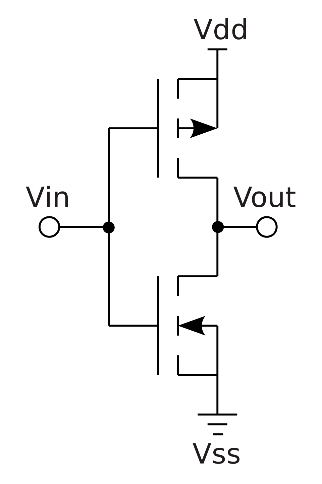
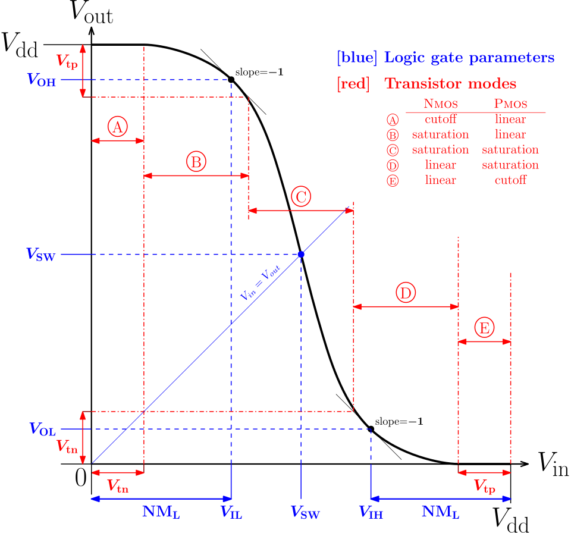
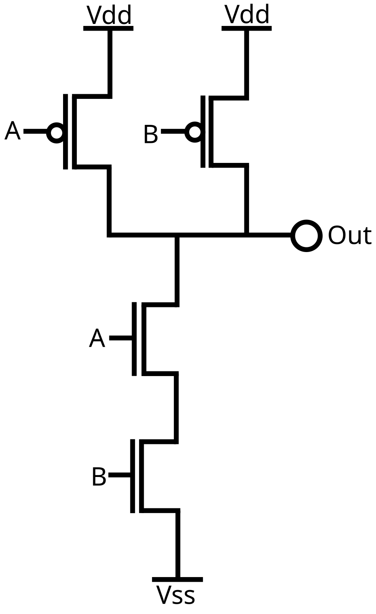

# 01 — MOSFET과 CMOS 논리 게이트

> 목표: 스위치(트랜지스터) 몇 개로 어떻게 "논리(0/1 계산)"를 만드는지. 모든 디지털 회로의 기본.

> **용어 주의**: 이 장에서 "게이트"가 두 가지 뜻으로 쓰인다. ① 트랜지스터의 세 단자 중 하나(Source·**Gate**·Drain) — 트랜지스터 하나의 부품. ② 인버터·NAND·NOR 같은 "논리 게이트(Logic Gate)" — 트랜지스터 여러 개를 조합해 만든 회로 덩어리, 그 자체로 하나의 논리 연산(AND/OR/NOT 등)을 수행함. 후자는 "조건에 따라 신호를 통과시키거나 막는다(gating)"는 뜻에서 이름이 왔다. 트랜지스터 레벨(①)과 회로 레벨(②), 완전히 다른 크기의 개념이 같은 단어를 쓰는 것뿐이다.

---

## 1. 두 종류의 스위치: NMOS와 PMOS

00장에서 트랜지스터 = 전압으로 여닫는 스위치라고 했다. 그런데 스위치가 두 종류다. **정반대로 동작한다.**

### MOS가 뭔가 — 이름부터

게이트 구조를 아래에서 위로 쌓으면:
```
  게이트 전극(Metal)        ← 여기 전압을 건다
  ─────────────────
  산화막(Oxide, SiO₂)       ← 절연체, 전류가 안 통함
  ─────────────────
  실리콘 기판(Semiconductor)  ← 이 안에 채널이 생김
```
이 세 겹 샌드위치 이름을 그대로 딴 게 **MOS = Metal-Oxide-Semiconductor**다. **MOSFET** = MOS + FET(Field-Effect Transistor, 전계효과 트랜지스터) — 게이트에 전류가 흐르는 게 아니라, 산화막 너머로 걸리는 **전기장(field)**이 채널의 전자/정공을 밀거나 끌어서 스위치를 여닫기 때문에 "전계효과"다.

"트랜지스터"는 상위 개념(3단자 스위치 전체)이고, MOSFET은 그중 **오늘날 디지털 칩이 쓰는 특정 종류**다. 00장에서 본 브레드보드용 낱개 부품(TO-92, 다리 3개)은 보통 **BJT(Bipolar Junction Transistor)** 라는 다른 종류로, 전압이 아니라 **전류**로 제어한다. BJT는 NPN/PNP처럼 P·N형 층을 실제로 쌓인 순서 그대로(3글자) 이름 붙이지만, MOSFET은 소스·드레인이 무슨 타입이냐(1글자: N형이면 NMOS, P형이면 PMOS)로만 이름 붙인다 — 도핑(P형/N형) 개념 자체는 똑같은데, 소자 구조가 달라서 이름 붙이는 관례가 다른 것.

| 종류 | 게이트에 High(1) 주면 | 게이트에 Low(0) 주면 | 역할 |
|------|----------------------|---------------------|------|
| **NMOS** | 켜짐(ON, 통함) | 꺼짐(OFF) | 아래로 당김 (GND 연결) → **Pull-down** |
| **PMOS** | 꺼짐(OFF) | 켜짐(ON, 통함) | 위로 당김 (전원 연결) → **Pull-up** |

외우는 법:
- **N**MOS는 1(High)에서 켜진다 → 출력을 0(GND)으로 끌어내림
- **P**MOS는 0(Low)에서 켜진다 → 출력을 1(VDD)로 끌어올림
- 둘은 **항상 반대**로 논다. 이 "반대 성질"이 CMOS의 핵심.

> **CMOS** = Complementary MOS = "상보적(반대되는) MOS". NMOS와 PMOS를 짝지어 쓴다는 뜻.

### Source·Drain·기판(Body) — 이름 그대로의 뜻

- **기판(Substrate/Body)**: 트랜지스터 전체가 만들어지는 바탕 재료. 도마 위에 다른 재료를 파서 박아넣듯, NMOS는 P형 기판에 N형 영역 두 곳을 심는다. 스위칭엔 능동적으로 참여 안 하고 고정 전압에 묶인 "바탕" 역할이라 이름에 판(board)이 붙었다.
- **소스(Source)**: 말 그대로 "공급원". 채널로 흘러들어갈 전하 캐리어가 나오는 쪽.
- **드레인(Drain)**: 말 그대로 "배수구". 캐리어가 채널을 통과해 빠져나가는 쪽.

```
Source(공급) → [Gate가 여닫는 채널] → Drain(배출)
                     ↑
           기판(Substrate) 위에 이 셋이 다 박혀있음
```

### 왜 이렇게 동작하나 — 반전층(Inversion Layer)의 물리

게이트-산화막-기판은 사실 작은 **축전기(capacitor)** 다. 게이트에 전압을 걸면 산화막 바로 아래 표면에 전기장이 걸려서, 그 자리의 캐리어를 끌어당기거나 밀어낸다.

**NMOS (P형 기판)** — 원래 그 자리는 정공이 많은 P형이다.
```
OFF (게이트 0V):                    ON (게이트 +전압):

  Gate ══════                       Gate ══════
  ░░░░░░░░░░░  ← 산화막              ░░░░░░░░░░░
 N+┌──┐  ┌──┐N+                    N+┌──┬────┬──┐N+
Src│N │P │N │Drn                  Src│N│반전층│N│Drn
   └──┘  └──┘                        └──┴(전자)┴──┘
   ─── P형 기판 ───                   ─── P형 기판(깊은 곳은 그대로) ───

  N-P-N 구조라 다이오드 두 개가        표면 얇은 층만 전자가 모여
  등돌리고 붙은 모양 → 전류 안 통함     N형처럼 뒤집힘(반전) → Src-Drn 다 N으로 이어짐
```
게이트에 +전압을 주면 정공(+)은 밀려나고 소수 캐리어인 전자(−)가 표면으로 끌려온다. 문턱전압을 넘으면 표면이 **P→N으로 뒤집혀(반전)** Source(N)-반전층(N)-Drain(N)이 끊김 없이 이어진다. **"반전"이란 표면의 캐리어 타입이 기판 원래 타입과 반대로 뒤집히는 것**이지, 단순히 "전자가 왔다"가 기준이 아니다.

**PMOS (N형 기판)** — 원래 그 자리는 전자가 많은 N형이다. 그래서 게이트에 +전압을 줘도 전자가 표면에 더 쌓일 뿐(원래 N형 강화 = **축적accumulation**, 반전 아님) → 정공이 모이는 곳이 어디에도 없어 Source(P)-Drain(P)를 못 잇는다 → OFF. 반대로 게이트를 낮은/음의 전압으로 만들면 이번엔 전자가 밀려나고 소수 캐리어인 정공(+)이 **같은 표면**에 끌려와 N→P로 뒤집힌다(반전) → P형 채널 완성 → ON.

> 헷갈리기 쉬운 점: "전자가 게이트 쪽에 몰리면 정공은 밀려서 딴 곳에 쌓이지 않나?" — 아니다. 게이트 전기장은 표면에서 멀어질수록 급격히 약해진다(차폐screening). 표면 근처 나노미터 두께에서만 반전/축적이 일어나고, 그 아래 깊은 기판은 그냥 원래 상태 그대로 남는다. 정공이 끌려오는 위치도 "전자가 밀려난 먼 곳"이 아니라 **항상 게이트 바로 밑, 같은 표면**이다.

### "1을 준다"는 게 뭔가 — VDD·GND·Vgs·Vds

**전압이 뭔지부터.** 전압은 "전자가 많다/적다(그건 전하량)"가 아니라, 두 지점 사이의 **전위차** — 전하를 그 지점에서 다른 지점으로 옮기면 에너지를 얼마나 뽑아낼 수 있나를 나타내는 값이다. 물 비유로 "전하=물", "전압=물탱크의 높이차"라고 보면 된다. 높이차가 있어야 물이 흐르며 일을 하듯, 전압차가 있어야 전하가 이동하며 회로가 동작한다. 그래서 전압은 항상 **"어디 대비 얼마"**로만 의미가 있는 상대적인 값이다.

디지털 0/1은 실은 **전압의 두 레벨**이다. "게이트에 1을 준다" = "게이트 단자에 (기준 대비) 양의 전압을 물리적으로 걸어준다"는 뜻.

- **VDD**: 칩 전체가 공유하는 전원의 + 쪽 (예: 1V). 배터리 + 단자라고 생각하면 됨.
- **GND(=VSS)**: 칩 전체가 공유하는 전원의 − 쪽, 기준 0V.
- **Vgs (Gate−Source)**: VDD/GND가 칩 전체 공통 기준선이라면, Vgs는 **트랜지스터 하나하나**가 "자기 소스 대비 얼마를 받고 있나"를 재는 상대값. 왜 상대적으로 재냐면 — 소스가 항상 GND에 붙어있는 게 아니기 때문. (2번 섹션에서 볼 CMOS 인버터에서 NMOS 소스는 GND에, **PMOS 소스는 VDD에** 붙는다.) 그래서 PMOS는 게이트가 절대전압으로 0V여도, 자기 소스(VDD) 기준으로 보면 Vgs = 0V − VDD = **−VDD (진짜 마이너스)** 가 걸려서 정공을 끌어당길 수 있다.
- **Vds (Drain−Source)**: 채널이 열린 다음, 그 통로로 전류가 얼마나 세게 흐르는지를 결정. 수도꼭지 비유로 Vgs는 "손잡이를 얼마나 돌렸나(밸브 개폐)", Vds는 "파이프 양끝 수압차(실제 흐르는 양)".

---

## 2. 가장 간단한 회로: 인버터 (NOT 게이트)

인버터는 **입력을 뒤집는다**. 1 넣으면 0, 0 넣으면 1. 트랜지스터 딱 2개(PMOS 1 + NMOS 1)로 만든다.


*위: PMOS(전원 Vdd에 연결), 아래: NMOS(접지 Vss에 연결). 입력 Vin은 두 게이트에 동시에. 출처: Wikimedia `CMOS inverter.svg`*

### 회로도 읽는 법

- **Vin**: 입력 신호. 위·아래 트랜지스터의 게이트에 **동시에** 연결된다 (하나의 신호가 둘로 갈라져 들어감).
- **Vout**: 출력 신호. PMOS와 NMOS의 다른 쪽 끝이 만나는 지점 — "지금 이 순간 Vout이 Vdd와 이어졌나, Vss와 이어졌나"로 값이 정해진다.
- **기호 해석 (화살표 방식)**: 세로 막대=채널, 그 옆 살짝 떨어진 짧은 선(틈=산화막)=게이트. **화살표가 채널 쪽으로 들어가면 PMOS, 밖으로 나가면 NMOS.** (BJT의 PNP는 화살표가 안으로, NPN은 밖으로 향하는 것과 같은 규칙 — 화살표는 항상 P→N 방향을 가리키는 다이오드 표기 관례를 따른다.) 채널에 틈 없이 바로 붙은 곁가지가 있다면 그건 **기판(Body)** 단자의 흔적으로, 이 단순화된 그림에서는 어디에도 안 잇고 놔둔 것.
- 회로도에서 배선이 직각으로 꺾인 모양(⌐ 자 등)은 대부분 **그냥 그림을 예쁘게 배치하려는 것**이지 전기적 의미는 없다. "이 선이 결국 어느 라벨(Vdd/Vin/Vout/Vss)에 닿는가"만 추적하면 됨.
- NAND 등 다른 그림에서는 화살표 대신 **게이트 앞에 작은 동그라미(버블)**로 PMOS를 표시하기도 한다(버블=NOT 게이트 출력 표시와 같은 "반전/Low에서 활성화" 의미). 이 방식이 실무에서 더 흔하다.

### 어떻게 뒤집히나

스위치를 **"배선을 잇거나 끊는 것"**으로만 생각하면 된다. ON=두 지점을 하나의 전선으로 땜질한 것, OFF=가위로 잘라놓은 것.

**입력이 High(1)일 때:**
- NMOS(아래): High에서 켜짐(ON) → Vout과 GND(0)가 **하나의 전선**이 됨 → Vout = 0
- PMOS(위): High에서 꺼짐(OFF) → Vout과 VDD는 **완전히 남남** → VDD가 얼마든 상관없음
- → **출력 = 0** ✅ (뒤집힘)

**입력이 Low(0)일 때:**
- PMOS(위): Low에서 켜짐(ON) → Vout과 VDD가 하나의 전선이 됨 → Vout = VDD(1)
- NMOS(아래): 꺼짐(OFF) → Vout과 GND는 남남
- → **출력 = 1** ✅ (뒤집힘)

> Vgs로 확인: PMOS 소스는 Vdd에 붙어있으므로, Vin=1(=VDD)이면 Vgs = VDD−VDD = 0 → OFF. Vin=0이면 Vgs = 0−VDD = **−VDD(마이너스)** → ON. **Vgs=0은 OFF 조건**이지 ON 조건이 아니다 — "게이트 절대전압이 0"과 "Vgs가 0"은 다른 얘기임에 주의 (PMOS 소스가 GND가 아니라 VDD에 있기 때문).

> 💡 **왜 하필 NMOS는 GND쪽, PMOS는 VDD쪽에 두나**: NMOS·PMOS가 스위치로 동작하는 원리 자체는 어디에 연결하든 똑같다. 이 배치는 "0과 1을 끝까지 확실하게 만들어내기 위한 설계 선택"이다 — NMOS는 출력을 0으로 끌어내리는 데 강하고(끝까지 확실히 0을 만듦), PMOS는 반대로 1을 만드는 데 강하다. 그래서 각자 잘하는 자리(NMOS→pull-down, PMOS→pull-up)에 배치해 완벽한 0/1을 만든다.

### CMOS가 천재적인 이유: 전력을 거의 안 쓴다
어떤 입력이든 **PMOS·NMOS 중 하나는 반드시 꺼져 있다.** 전원(VDD)에서 접지(GND)로 곧장 흐르는 관통 전류가 없다. → **가만히 있을 때 전력 소모 ≈ 0.** 이게 오늘날 모든 칩이 CMOS인 이유.

전력을 쓰는 순간은 **스위칭할 때(0↔1 바뀔 때)**뿐이다:
```
동적 전력 P = α · C · V² · f
  α: 스위칭 활동도,  C: 커패시턴스,  V: 전압,  f: 클럭 주파수
```
→ **전압(V)을 낮추면 전력이 제곱으로 준다.** 저전력 설계의 제1원칙.

### 전압 전달 특성(VTC) — 입력이 애매하면?

*입력 전압(가로)에 따른 출력 전압(세로). 중간(VDD/2 근처)에서 급격히 뒤집힌다. 이 급한 기울기가 "0과 1을 확실히 구분"해 노이즈에 강하게 만든다. 출처: Wikimedia `Static CMOS inverter VTC.svg`*

> 이 그림엔 VOH·VOL·VIL·VIH·NML, ⓐ~ⓔ(NMOS/PMOS의 cutoff·linear·saturation 구간) 같은 세부 라벨이 잔뜩 있는데, 이건 노이즈 마진을 정량적으로 분석하는 회로 설계 실무 수준이라 지금은 몰라도 된다. 지금 필요한 직관은 딱 하나: **"양 끝은 평평, 중간만 급격히 전환"이라 입력이 조금 흔들려도 출력은 확실한 0 또는 1로 나온다**는 것.

---

## 3. NAND 게이트 — 진짜 계산의 시작

NAND는 "**둘 다 1일 때만 0, 나머지는 1**"이다. 트랜지스터 4개(PMOS 2 + NMOS 2).


*위: PMOS 2개 **병렬**, 아래: NMOS 2개 **직렬**. 출처: Wikimedia `CMOS NAND.svg`*

이 그림은 화살표 대신 **게이트 앞 작은 동그라미(버블)**로 PMOS를 표시한다 (버블 없음=NMOS). 입력 A·B는 각각 PMOS 하나 + NMOS 하나, 총 2개의 게이트로 갈라져 들어간다 — 인버터에서 Vin 하나가 게이트 2개로 갈라졌던 것과 같은 패턴이 입력 2개짜리로 늘어난 것뿐. A끼리, B끼리 서로 전선으로 이어진 게 아니라 그냥 같은 신호가 두 군데로 복사돼 들어가는 것.

### 진리표
| A | B | 출력 |
|---|---|------|
| 0 | 0 | 1 |
| 0 | 1 | 1 |
| 1 | 0 | 1 |
| 1 | 1 | **0** |

### 왜 이렇게 연결하나 (직렬 vs 병렬)
- **아래 NMOS 2개는 직렬**: A와 B가 **둘 다** 1이어야 GND까지 길이 뚫려 출력이 0이 된다. (직렬 = AND 조건)
- **위 PMOS 2개는 병렬**: A나 B **하나라도** 0이면 VDD로 길이 뚫려 출력이 1. (병렬 = OR 조건)
- NMOS와 PMOS는 항상 반대니까, 이 둘이 자동으로 상보적으로 동작한다.

> **NAND가 특별한 이유**: NAND만으로 세상의 모든 논리회로(AND, OR, NOT, XOR, 덧셈기, CPU까지)를 만들 수 있다. "만능 게이트(Universal Gate)".

### NAND 하나로 다 만들기 (증명)

모든 논리 함수는 AND·OR·NOT 세 개만으로 표현 가능하다는 게 불 대수의 기본 성질이다. NAND로 이 셋을 다 만들 수 있으면, NAND 하나로 뭐든 만들 수 있다는 게 자동으로 따라온다.

- **NOT**: 입력 두 개를 같은 신호로 묶기 → `NAND(A,A) = NOT(A)`
- **AND**: NAND 결과를 한 번 더 뒤집기 → `NAND(A,B)`의 출력을 NAND 하나로 또 NOT → `AND(A,B)`
- **OR**: 드모르간 법칙(`A OR B = NOT((NOT A) AND (NOT B))`) 이용 → A 뒤집고, B 뒤집고, 그 둘을 NAND
- **XOR**: NAND 4개로 구성 가능 (`n1=NAND(A,B)`, `n2=NAND(A,n1)`, `n3=NAND(B,n1)`, `XOR=NAND(n2,n3)`)

이렇게 만든 NOT·AND·OR·XOR을 반가산기(XOR+AND) → 전가산기 → ALU → CPU로 계속 쌓아 올리면 된다 (4번 섹션의 계층도가 이 과정). 심지어 메모리(플립플롭)도 NAND 2개를 서로 마주보게 엇갈려 연결(cross-coupled)하면 만들어진다 — 02장 SRAM의 "두 인버터가 서로 붙잡는" 원리와 같은 아이디어를 인버터 대신 NAND로 한 것.

> **주의 — 이건 "최소 요건 증명"이지 실제 최적 설계가 아니다.** 실무에서 NOT이 필요하면 그냥 인버터(트랜지스터 2개)를 쓰지, NAND(A,A)(트랜지스터 4개)로 안 만든다. 표준 셀 라이브러리에는 INV·NAND·NOR·XOR·복합 게이트가 이미 다 있고, 설계 툴이 상황에 맞게 가장 빠르고 작은 걸 고른다. 그래도 NAND/NOR이 특히 자주 보이는 이유는, CMOS 구조상 **NAND/NOR이 트랜지스터 개수가 가장 적은 "네이티브" 형태**라서다 (진짜 AND는 NAND+인버터가 필요해 트랜지스터가 더 들고 속도도 느려짐) — 이론적 만능성과 실무적 효율성이 우연히 겹치는 지점.

### NOR와의 차이
NOR는 반대로 NMOS 병렬 + PMOS 직렬. 실무에선 NAND를 NOR보다 선호하는데, **전자(NMOS 캐리어)가 정공(PMOS 캐리어)보다 빨라서** NMOS를 직렬로 쌓는 NAND가 속도상 유리하기 때문.

---

## 4. 여기서 CPU까지 올라가는 길 (개념만)
```
트랜지스터 → 게이트(NAND/NOR/인버터) → 가산기·멀티플렉서 → ALU → CPU/GPU
```
계층이 올라갈수록 추상화된다. **소프트웨어의 함수 호출 스택과 똑같은 구조** — 낮은 레벨 블록을 조합해 높은 기능을 만든다.

---

## 5. 메모리 칩에서의 적용

메모리 칩도 결국 트랜지스터로 만든다. 특히 **센스 앰프, 주변 회로(peripheral)**는 CMOS 로직으로 구성된다. 저전력·고속 설계에서 인버터/게이트의 전력·속도 트레이드오프는 수율과 직결된다.

## 💡 시스템·SW 관점 (전자과가 잘 안 보는 것)

- **동적 전력 P = αCV²f 는 데이터센터 전력 소비의 근본이다.** 클럭(f)이 오를수록 발열이 커지고, 발열은 스로틀링(throttling)으로 이어진다.
- 게이트를 조합해 상위 기능을 만드는 계층 구조는 **소프트웨어 추상화 계층과 동형(isomorphic)**이다. 회로 계층과 소프트웨어 계층은 같은 사고방식으로 넘나들 수 있다.
- CMOS의 "정적 전력 0" 덕분에 idle CPU/GPU가 전기를 거의 안 쓴다 — 이는 클라우드 자원 스케줄링(사용률 기반 오토스케일링 등)의 하드웨어적 근거가 된다.

---

## 확인 문제
1. NMOS와 PMOS는 각각 언제 켜지나? 한 문장씩.
2. MOS라는 이름은 어떤 구조에서 왔나? BJT(NPN/PNP)와 이름 붙이는 방식이 어떻게 다른가?
3. "반전(inversion)"이 정확히 뭔가? NMOS·PMOS에서 반전층에 모이는 캐리어는 각각 뭔가?
4. PMOS는 왜 게이트 절대전압이 0V(GND)여도 켜지는가? (Vgs 관점에서 설명)
5. Vgs와 Vds는 각각 무엇을 결정하나?
6. 전압은 "전자가 많고 적음"과 뭐가 다른가?
7. 회로도에서 화살표(또는 버블)가 어느 쪽을 가리키면 PMOS인가?
8. CMOS 인버터에서 Vin=1일 때, Vout이 왜 VSS와 "같아지는지"를 스위치(배선 연결/차단) 관점에서 설명하라.
9. 왜 NMOS는 항상 GND쪽, PMOS는 VDD쪽에 배치하나?
10. CMOS 인버터가 "가만히 있을 때 전력을 안 쓰는" 이유는?
11. 동적 전력 공식에서 전압을 낮추면 왜 좋은가?
12. NAND에서 NMOS를 직렬로, PMOS를 병렬로 놓는 이유는?
13. "NAND는 만능 게이트"라는 말의 의미는? NAND로 NOT을 만드는 방법은?
14. 실제 칩 설계에서 모든 걸 NAND로만 만들지 않는 이유는?

---

**이전 ← [00: 반도체 소자 기초](00_semiconductor_device_basics.md) | 다음 → [02: 메모리 셀 구조](02_memory_cell_architectures.md)**
