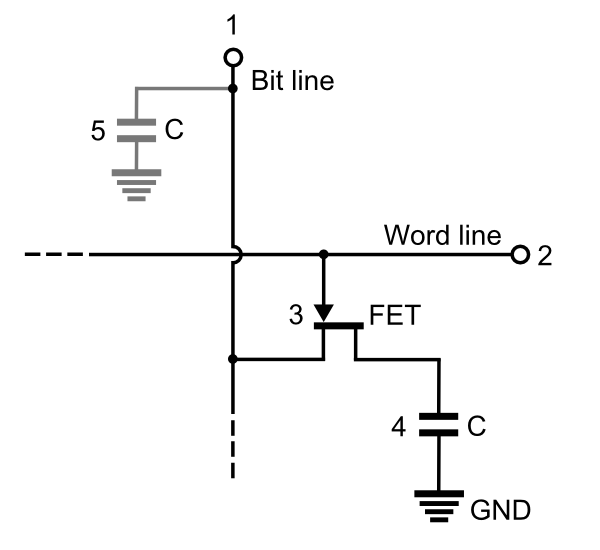
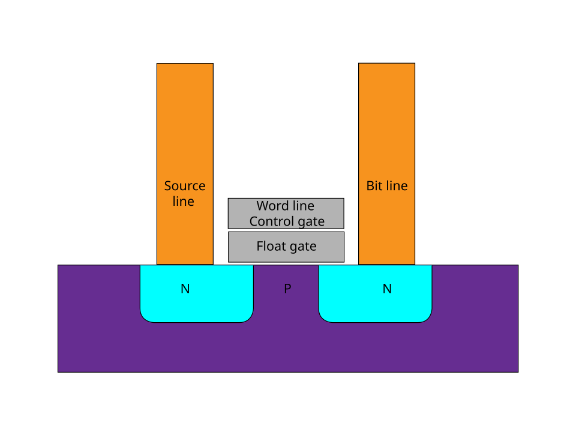
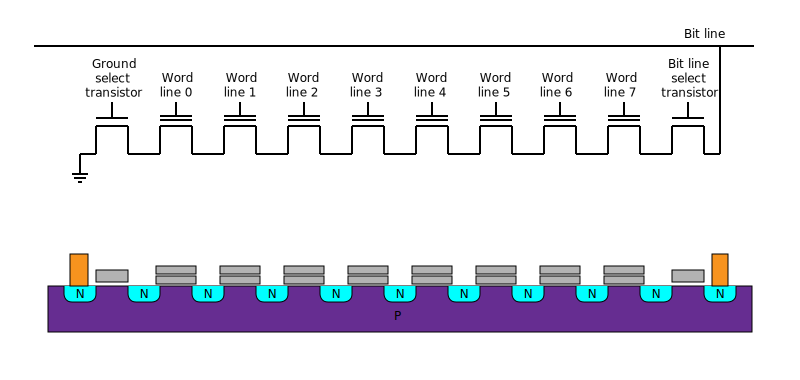

# 02 — 메모리 셀 구조: SRAM · DRAM · NAND · HBM ★

> 목표: DRAM·SRAM·NAND·HBM이 각각 어떻게 1비트를 저장하는지. 메모리 반도체 설계의 핵심 파트.

---

## 0. 큰 그림: 세 가지 저장 방식

| 메모리 | 1비트 저장 방법 | 전원 끄면 | 속도 | 밀도 | 용도 |
|--------|----------------|-----------|------|------|------|
| **SRAM** | 회로(래치)가 서로 붙잡음 | 사라짐 | 매우 빠름 | 낮음 | CPU 캐시 |
| **DRAM** | 커패시터에 전하 저장 | 사라짐 | 중간 | 높음 | 주 메모리, **HBM** |
| **NAND** | 절연막 안에 전하 가둠 | **유지됨** | 느림 | 매우 높음 | SSD, USB |

핵심 직관: **"전하를 어디에, 얼마나 단단히 가두느냐"**가 세 메모리를 가른다.

---

## 0-1. 사전지식 — 저항 · 커패시터 · 인덕터: 회로의 3대 기본 부품

DRAM을 이해하려면 **커패시터**부터 알아야 한다. 전자공학에는 트랜지스터(01장) 같은 "능동소자"와 별개로, 그 자체로 아무 판단도 안 하고 그냥 물리 법칙대로 반응만 하는 **수동소자 3형제 — 저항(R) · 커패시터(C) · 인덕터(L)**가 있다. 이 셋을 물 비유로 정리하면:

| 소자 | 하는 일 | 저장 형태 | 물 비유 | 핵심 수식 |
|------|---------|-----------|---------|-----------|
| **저항 (Resistor)** | 전류 흐름을 방해 | (저장 안 함) | 좁아진 파이프 | V = I·R |
| **커패시터 (Capacitor, 축전기)** | 전하를 저장 | 전기장 | 물통 | Q = C·V |
| **인덕터 (Inductor)** | 전류 변화에 저항 | 자기장 | 무거운 수차(관성) | V = L·(dI/dt) |

### 저항 (Resistor)
전류가 흐르는 걸 방해하는, 가장 단순한 부품. 파이프를 일부러 좁혀놓은 것과 같다 — 좁을수록(저항이 클수록) 같은 압력(전압)에도 물(전류)이 적게 흐른다. 저장 기능은 없고 그냥 "흐름을 줄이는" 역할만 한다.

### 커패시터 (Capacitor, 축전기)
금속판 두 장을 절연체를 사이에 두고 가깝게 마주보게 만든 부품. 전압을 걸면 한쪽 판엔 +전하, 반대쪽 판엔 −전하가 쌓이고, 절연체 때문에 서로 못 건너가 그대로 "고여" 있는다 — 이게 물통 비유의 정체다. DRAM 셀(1T1C)의 저장 소자가 바로 이거다 (→ 1절).
- 전압이 급격히 바뀌는 걸 완충하는 데도 쓰인다 (예: GPU 보드의 디커플링 커패시터 — 04장에서 다룸).
- 시간이 지나면 절연체를 통해 전하가 조금씩 샌다(누설) → DRAM이 refresh가 필요한 이유가 바로 이 물리적 성질이다.

### 인덕터 (Inductor)
전선을 코일 모양으로 감아놓은 부품. 전류가 흐르면 코일 주위에 자기장이 생기는데, 전류가 갑자기 바뀌려 하면 그 자기장이 변화에 저항한다 — "전류야, 갑자기 바뀌지 마"라며 관성처럼 버티는 셈. 그래서 여러 회로가 동시에 스위칭해 전류가 급변하면, 배선의 인덕턴스 때문에 전압이 순간적으로 출렁인다(Ground/Power Bounce, V = L·dI/dt) — 04장에서 신호무결성 문제로 다시 등장한다.

> **정리**: 트랜지스터(능동소자, 01장)는 "전압으로 여닫는 스위치"였다면, 이 셋(수동소자)은 스위치가 아니라 그냥 전기적 성질을 갖는 "재료"에 가깝다. 이 중 **커패시터**가 이번 장(DRAM)의 핵심 부품이고, 저항·인덕터는 04장(아날로그/신호무결성)에서 다시 만난다.

---

## 1. DRAM — 커패시터에 전하를 담는다 (1T1C)

**D**ynamic **R**andom **A**ccess **M**emory. "Dynamic(동적)"은 가만히 두면 전하가 새서 사라지니까 계속 "움직여줘야"(refresh) 유지된다는 뜻 — 2절에서 배울 SRAM의 "Static(정적)"과 정확히 대구를 이룬다. Random Access는 SRAM과 동일하게, 순서와 상관없이 어느 위치든 비슷한 속도로 접근 가능하다는 뜻.

DRAM 셀 하나 = **트랜지스터 1개 + 커패시터 1개** (그래서 1T1C). 구조가 단순해서 아주 작게 만들 수 있다 → 대용량.


*Word line(2)으로 트랜지스터(3, FET)를 열면, Bit line(1)의 전하가 커패시터(4, C)에 저장된다. 5는 비트라인 자체 기생 용량. 출처: Wikimedia `DRAM Cell Structure.PNG`*

### 동작 (아파트 비유)
커패시터(4번, 물통) = 데이터가 실제로 사는 집. 물이 차 있으면 1, 비어 있으면 0. DRAM 전체는 **아파트 단지**라고 보면 된다 — Word line(2번)이 "층", Bit line(1번)이 "동"이다.

- **쓰기**: 원하는 값을 Bit line(동)에 미리 실어놓고(1이면 높은 전압 VDD, 0이면 낮은 전압 GND) → Word line(층)을 열어 그 층 전체의 트랜지스터(3번) 스위치를 ON → 각 동의 커패시터가 자기 동 Bit line 전압까지 충전/방전됨 → Word line을 닫으면 전하가 갇혀서 저장 완료. **한 층을 열면 그 층의 모든 동에 동시에(각자 다른 값으로) 쓸 수 있다** — 동마다 파이프(Bit line)가 독립적이라서.
- **읽기**: Bit line을 미리 "1도 0도 아닌 중간 기준전압"(VDD/2쯤)으로 맞춰둠(precharge) → Word line을 열면 커패시터의 전하가 Bit line으로 흘러나오며 그 기준전압을 아주 살짝(수십 mV) 위(1이었을 때) 또는 아래(0이었을 때)로 흔듦 → **센스 앰프**가 그 미세한 흔들림의 방향을 감지해 0/1로 증폭 판독.

> **행×열 주소 방식의 장점**: 셀 하나하나에 전선을 따로 뽑으면 셀이 N×M개일 때 배선도 N×M개 필요하다. 대신 "층(Word line) N개 + 동(Bit line) M개"만 깔아두면, 층과 동의 **교차점 하나**로 N×M개의 셀을 전부 고유하게 지정할 수 있다 (배선 개수가 N×M → N+M으로 줄어듦). 게다가 층 하나를 열면 그 층의 모든 동을 **동시에 병렬로** 읽고/쓸 수 있어서 대역폭에도 유리하다.

### DRAM의 숙명 두 가지
1. **Refresh(새로고침)**: 커패시터는 시간이 지나면 전하가 샌다(누설). 그냥 두면 데이터가 사라진다. 그래서 **주기적으로(보통 64ms) 읽어서 다시 채운다.** "Dynamic"이란 이름이 여기서 나옴.
2. **파괴적 읽기(Destructive Read)**: 읽으면 커패시터가 비워진다. 그래서 읽은 직후 **다시 써넣는(restore)** 과정이 필수.

> Refresh는 사실 별개의 새로운 동작이 아니다 — 아무도 요청 안 해도 **모든 행에 대해 "읽기(파괴적) → 센스앰프 증폭 → restore"를 강제로 순서대로 반복**하는 것뿐이다. 어차피 읽을 때마다 해야 하는 restore 과정을 "아무도 안 읽어도 데이터가 새기 전에" 전 행에 걸쳐 주기적으로 돌리는 게 refresh다.

💡 **시스템·SW 관점 — refresh가 왜 중요한가**
> Refresh하는 동안 그 메모리 영역은 접근이 막힌다 = **대역폭 손실**. AI 학습처럼 HBM을 초당 수 TB로 두들기는 워크로드에선 refresh 오버헤드가 실제 성능을 갉아먹는다. "DRAM은 왜 SRAM보다 느린가?"의 답 중 하나가 이 refresh + 파괴적 읽기 + 센스 앰프 지연이다. **이게 Memory Wall의 하드웨어적 뿌리다.**

### 심화 — Refresh 최적화 기법

먼저 **뱅크(Bank)** 개념: DRAM 칩 내부는 하나의 거대한 행×열 격자가 아니라, 그 격자를 여러 개로 쪼갠 **독립된 구역(뱅크)**들로 이뤄져 있다. 각 뱅크는 자기만의 행·열·센스 앰프 세트를 따로 가져서, **한 뱅크가 refresh로 바쁜 동안 다른 뱅크는 완전히 별개로 요청을 처리**할 수 있다. (지금까지 쓴 아파트 비유를 확장하면 — 지금까지는 "동(Bit line) 하나" 안의 층·호수 얘기였다면, 실제 DRAM 칩은 **여러 동(뱅크)이 모인 단지 전체**다. 한 동이 소독 중이어도 옆 동은 정상 출입 가능한 것과 같다.)

이 뱅크 개념을 이용해 refresh의 대역폭 손실을 줄이는 기법들이 있다. 대부분 **JEDEC**(미국 반도체 표준화 기구, DDR/HBM 규격을 제정) 표준에 포함돼 SK하이닉스·삼성·마이크론 등 모든 DRAM 제조사가 공통으로 구현한다.

| 기법 | 핵심 아이디어 | 적용 범위 |
|---|---|---|
| **Per-bank Refresh** | 뱅크 전체를 한꺼번에 멈추지 않고 뱅크 하나씩 돌아가며 refresh → 나머지 뱅크는 계속 서비스 | JEDEC DDR4부터 표준 |
| **Temperature-Compensated Refresh (TCR)** | 온도 센서로 누설 속도를 보고 refresh 주기를 동적 조절 (뜨거우면 자주, 차가우면 덜 자주) | JEDEC 표준 옵션. HBM3E가 GPU 다이보다 낮은 온도(~95°C)에서 먼저 throttling되는 현상과 같은 맥락 (→ 열 얘기는 04장) |
| **Fine Granularity Refresh (FGR, 1x/2x/4x)** | refresh를 "짧고 자주" 또는 "길고 드물게" 중 선택해 지연 vs 오버헤드 트레이드오프 조절 | DDR4/DDR5 JEDEC 표준 |
| **Partial Array Self-Refresh (PASR)** | 실제 데이터 있는 영역만 refresh, 빈 뱅크는 건너뜀 | 주로 LPDDR(모바일/저전력) 표준 |
| **컨트롤러의 refresh 스케줄링** | 트래픽 몰릴 때 refresh를 뒤로 미루고 한가할 때 몰아서 처리 (JEDEC 허용 유예 범위 내) | 메모리 컨트롤러(호스트 측) 구현 |
| **Retention-aware / Adaptive Refresh** | 셀마다 다른 실제 누설 속도를 측정해 약한 행만 자주, 강한 행은 덜 자주 refresh | 학계 연구(RAIDR 등) 중심, 상용 적용 여부는 비공개 |

> **주의**: 위 표의 JEDEC 표준 기법은 SK하이닉스만의 고유 기술이 아니라 **업계 공통 규격**이다. "SK하이닉스가 이런 결과 스펙(예: HBM3E의 95°C throttling)을 내놓는다"까지는 공개 정보로 확인되지만, 그 내부 구현 디테일은 회사 기밀이다.

---

## 2. SRAM — 회로가 서로 붙잡아 기억한다 (6T)

**S**tatic **R**andom **A**ccess **M**emory. "Static(정적)"이 DRAM의 "Dynamic(동적)"과 정확히 대구를 이룬다 — refresh 없이 전원만 있으면 스스로 상태를 유지한다는 뜻이 이름에 그대로 담겨 있다.

SRAM 셀 하나 = **트랜지스터 6개**. 두 개의 인버터가 서로의 출력을 물고 있어(cross-coupled), 전원만 있으면 상태를 스스로 유지한다. Refresh 불필요.


*M1~M4가 두 인버터(래치), M5·M6는 접근 스위치. Q와 Q̄(반대값)가 서로를 붙잡는다. WL로 열고 BL/BL̄로 읽고 쓴다. 출처: Wikimedia `SRAM Cell (6 Transistors).svg`*

### 트랜지스터 6개의 역할 — "인버터 2개 + 접근 스위치 2개"

| 트랜지스터 | 종류 | 역할 |
|---|---|---|
| M2 | PMOS | 왼쪽 인버터 pull-up (VDD ↔ Q̄) |
| M1 | NMOS | 왼쪽 인버터 pull-down (GND ↔ Q̄) |
| M4 | PMOS | 오른쪽 인버터 pull-up (VDD ↔ Q) |
| M3 | NMOS | 오른쪽 인버터 pull-down (GND ↔ Q) |
| M5 | NMOS 접근 스위치 | WL이 열리면 BL̄ ↔ Q̄ 연결 |
| M6 | NMOS 접근 스위치 | WL이 열리면 BL ↔ Q 연결 |

M1+M2, M3+M4는 각각 01장에서 배운 **CMOS 인버터 그 자체**다. 새로운 부품은 없다 — 인버터 2개를 마주보게 배선하고, DRAM의 3번 트랜지스터와 같은 역할의 접근 스위치 2개(M5, M6)를 붙인 것뿐이다.

### Q와 Q̄ — 저장되는 건 "노드의 전압 상태" (그릇이 아니다)

DRAM은 커패시터라는 별도의 그릇에 전하를 담았다. SRAM엔 그런 그릇이 없다. 대신 **Q라는 노드가 지금 VDD에 연결돼 있나 GND에 연결돼 있나 — 그 연결 상태 자체가 데이터**다.
- Q=1: M4(PMOS) ON → Q가 VDD에 연결. M3(NMOS) OFF → GND로부터 차단.
- Q=0: M3(NMOS) ON → Q가 GND에 연결. M4(PMOS) OFF → VDD로부터 차단.

Q̄는 Q와 별개의 데이터가 아니라 **같은 1비트를 반대쪽에서 비춘 그림자**다 (Q를 알면 Q̄는 자동으로 안다 = 새 정보가 없다). 셀 하나 = 1비트, 정보량은 그대로다. 그런데도 Q̄가 실제로 존재하는 이유는 둘: ① 인버터 2개로 폐루프를 만들다 보니 구조상 필연적으로 생기는 노드, ② BL/BL̄ 차동(differential) 읽기·쓰기로 속도·노이즈 내성을 얻기 위함(아래 참고).

### 왜 안정적으로 유지되나 — 폐루프(feedback loop)

왼쪽 인버터: 입력=Q, 출력=Q̄. 오른쪽 인버터: 입력=Q̄, 출력=Q. Q=1로 가정하고 한 바퀴 돌려보면:

```
Q=1 → [왼쪽 인버터] → Q̄=0 → [오른쪽 인버터] → Q=1   (처음과 일치 → 모순 없음 → 안정)
```

인버터 **1개만으론 저장이 성립하지 않는다** — 인버터는 "지금 입력을 반영해 반대로 뱉는" 조합 회로일 뿐이라, 입력을 회로 바깥에서 계속 대주지 않으면 아무것도 기억 못 한다(입력이 끊기면 floating). 인버터 2개를 마주보게 이으면 각자의 입력이 "바깥"이 아니라 "서로의 출력"이 돼서, 외부 신호 없이도 스스로 완결되는 폐루프가 닫힌다 — 이게 "저장"이 성립하는 조건이다.

> 참고: 반드시 **짝수 개**의 인버터로 고리를 만들어야 한다. 홀수 개로 고리를 만들면 한 바퀴 돌 때마다 값이 뒤집혀서 계속 진동한다 — 이게 클럭 신호를 만드는 **링 오실레이터**(전혀 다른 용도의 회로)다.

### 시소 비유
두 인버터가 시소처럼 물려 있다. 한쪽이 1이면 다른 쪽이 0으로 고정 → 안정적으로 기억. 건드리지(WL 열지) 않으면 계속 유지.

### 쓰기 / 읽기

**쓰기**
1. BL(Q 쪽)에 원하는 값, BL̄에는 반대값을 강하게 드라이브 (예: 1을 쓰려면 BL=VDD, BL̄=GND)
2. WL을 열어 M5, M6 ON
3. 외부 드라이버의 힘이 기존 인버터 루프보다 강해서 Q, Q̄를 강제로 새 값에 맞게 뒤집음
4. 한 번 뒤집히면 인버터 루프가 스스로 그 상태를 재확인하며 고정 → WL을 닫아도 유지

**읽기**
1. BL, BL̄ **둘 다 VDD로 precharge** (DRAM처럼 중간 기준값이 아니다 — SRAM은 두 줄을 서로 비교하는 방식이라서)
2. WL을 열어 M5, M6 ON
3. 내부에서 0인 쪽 노드는 GND에 연결돼 있어서 자기 쪽 Bit line을 서서히 방전시킨다. 1인 쪽 노드는 이미 VDD라서 자기 쪽 Bit line이 그대로 유지된다 → BL과 BL̄ 사이에 전압 차이가 벌어짐
4. 센스 앰프가 그 차이를 감지·증폭해 0/1 판독. 읽는 동안에도 인버터 루프가 능동적으로 값을 붙잡고 있어 상태가 안 무너진다 (파괴적 읽기 아님, restore 불필요)

### 장단점
- ✅ **매우 빠름(1~2 클럭)** — 이유 셋: ① 파괴적 읽기가 아니라 restore가 불필요 ② 트랜지스터가 VDD/GND에 직접 연결돼 신호가 강해서 센스 앰프가 빨리 판독 가능(DRAM 커패시터의 미세한 mV 신호보다 훨씬 강함) ③ refresh로 인한 강제 휴지 시간이 없음
- ✅ Refresh 불필요 → **CPU L1/L2 캐시, 레지스터**에 적합
- ❌ 셀당 트랜지스터 6개 → 크고 비쌈. 대용량 불가.
- ❌ **누설전력(leakage power)**: "꺼진" 트랜지스터도 완벽한 개방 회로가 아니라서 미세한 전류(subthreshold leakage)가 계속 샌다. 데이터(전압) 자체는 반대편의 켜진 트랜지스터가 실시간으로 메꿔줘서 안전하지만, 그 메꾸는 행위 자체가 전력을 계속 소모한다 — 미세공정일수록 심해지는 실무 이슈다.
  > DRAM의 "커패시터 전하 누설"과는 완전히 다른 현상이다: DRAM은 **데이터가 새는 것**(그래서 refresh로 막음), SRAM은 **전력이 새는 것**(데이터는 안전, refresh로도 못 막음 — 애초에 데이터 문제가 아니라서).

> **DRAM vs SRAM 한 줄**: DRAM은 "작은 물통 하나"(1T1C, 싸고 크게, 대신 새고 느림), SRAM은 "서로 붙잡는 시소"(6T, 빠르지만 크고 비쌈).

---

## 3. NAND Flash — 전하를 절연막에 가둔다 (비휘발성)

NAND는 전원을 꺼도 데이터가 유지된다. 비결은 **플로팅 게이트(Floating Gate)** — 사방이 절연체로 막힌 "갇힌 게이트"에 전자를 가둬둔다.


*이 그림은 셀 하나의 물리적 단면도다(SRAM/DRAM 그림과 달리 회로 기호가 아니라 실리콘을 잘라본 모습). 보라색=P형 기판, 청록색 N=소스·드레인, 회색 2단=Control gate(Word line 연결)와 그 아래 절연된 Float gate. 출처: Wikimedia `Flash cell structure.svg`*

### 원리
- 높은 전압으로 전자를 플로팅 게이트에 밀어넣음(쓰기). 절연막에 갇혀 안 빠져나감 → 전원 꺼도 유지.
- 갇힌 전자 유무가 트랜지스터의 문턱전압을 바꿈 → 읽을 때 0/1 구분.
- 지울 땐 반대 전압으로 전자를 빼냄.

> **관례 — 왜 "전자 있음=0"인가**: 물리 법칙이 강제하는 게 아니라 업계 관례다. 이전 세대 메모리(EEPROM·퓨즈형 PROM)에서 "손 안 댄 기본 상태=1, 뭔가 가공한 상태=0"이라는 전통을 NAND가 물려받았다. 그래서 **지운(Erase) 직후 기본 상태 = 1**, **전자를 주입(Program)한 상태 = 0**으로 정의된다.

### 구조 — 체인(String) · 페이지(Page) · 블록(Block)


*체인(String) 하나를 옆에서 자른 모습. 맨 위 Bit line select transistor와 맨 아래 Ground select transistor 사이에, 플로팅 게이트 셀 8개가 Word line 0~7에 하나씩 물려 직렬로 이어져 있다. 출처: Wikimedia `Nand flash structure.svg`*

이 체인을 여러 개(비트라인마다 하나씩) 나란히 늘어놓고, 같은 높이의 Word line끼리 서로 연결하면 실제 NAND 어레이가 된다:

```
                BL0    BL1    BL2    BL3     ← 체인(비트라인) 여러 개
                 |      |      |      |
  WL(3)  ------ [셀] - [셀] - [셀] - [셀]   ← 페이지 3 (Word line 3에 걸친 가로줄)
  WL(2)  ------ [셀] - [셀] - [셀] - [셀]   ← 페이지 2
  WL(1)  ------ [셀] - [셀] - [셀] - [셀]   ← 페이지 1
  WL(0)  ------ [셀] - [셀] - [셀] - [셀]   ← 페이지 0
                 |      |      |      |
                공통 Source line

← 세로 한 줄(체인) = String       ← 가로 한 줄(Word line 하나) = Page
← 이 격자 전체(같은 P-well 위)   = Block  (지우기의 최소 단위)
```

- **체인(String)**: 셀들을 드레인-소스로 직렬 연결한 세로 한 줄. Bit line 하나를 따라 이어짐.
- **페이지(Page)**: 여러 체인에서 같은 Word line 하나에 해당하는 셀들의 가로줄. 읽기·쓰기의 최소 단위(보통 4~16KB). (OS 가상메모리의 "페이지"와는 이름만 같은 별개 개념 — OS 페이지는 소프트웨어가 관리하는 가상메모리 단위, NAND 페이지는 하드웨어가 한 번에 처리하는 최소 단위.)
- **블록(Block)**: 여러 체인이 **같은 P-well(기판)을 공유**하는 묶음. **지우기는 항상 블록 단위로만 가능** — 지우기가 "P-well 전체 전압을 확 끌어올리는" 방식이라, 그 well을 공유하는 모든 셀이 한꺼번에 지워질 수밖에 없다.

### 쓰기 (Program) — Fowler-Nordheim 터널링

1. Word line(Control gate)에 아주 높은 전압(+18~20V)을 건다. 컨트롤 게이트에 +전압이 걸리는 것.
2. 이 전압이 채널(P형 표면)에 전자를 끌어모아 일반 NMOS처럼 채널을 형성한다. 소스·드레인(N+ 영역)이 계속 전자를 리필해줘서, 플로팅 게이트로 일부가 넘어가도 채널이 고갈되지 않는다.
3. 전기장이 워낙 강해서 전자 일부가 절연막을 양자역학적으로 **터널링**해 플로팅 게이트로 넘어간다(재료가 파괴되는 게 아니라 확률적 통과 — 다만 반복되면 절연막이 조금씩 손상돼 wear-out이 생긴다).
4. 전자가 갇히면 = **"0"을 쓴 것**.
5. **Program은 항상 1→0 방향으로만 간다.** 0을 다시 1로 되돌리는 개별 동작은 없고, 그 **블록 전체를 지워야(Erase)** 한다 — "Flash"라는 이름 자체가 이 일괄 삭제 동작에서 왔다.
6. 같은 Word line(페이지) 위 여러 셀에 서로 다른 값을 동시에 쓸 때: 0으로 만들 셀의 Bit line엔 그대로 프로그램 전압을 걸고, 1로 유지할 셀의 Bit line 전압은 올려서 터널링을 억제(inhibit)한다.

### 지우기 (Erase)

Control gate는 0V로 두고, 대신 **P-well(기판)을 약 +20V까지 끌어올린다.** 그럼 플로팅 게이트가 상대적으로 낮은 전위가 되어, 전자가 반대 방향(플로팅 게이트→채널)으로 터널링해 빠져나간다 — 게이트에 직접 마이너스 전압을 만들기보다 기판을 올리는 쪽이 회로적으로 쉬워서 이 방식을 쓴다. 이 P-well을 공유하는 블록 전체가 한 번에 지워진다.

### 읽기 (Read)

예: 어떤 체인의 Word line(2), Bit line(1) 위치의 셀을 읽고 싶다고 하자.

1. Bit line을 precharge하고, **목표 셀을 제외한 나머지 모든 Word line에 "묻지도 따지지도 않고 켜지는" 높은 전압(Vpass, 약 6~8V)**을 건다 — 이 셀들은 저장값과 상관없이 무조건 ON.
2. **목표 셀의 Word line에만 판별용 전압(Vread, 0V 근처)**을 건다.
3. Bit line→Source line까지 전류가 흐르는지 확인한다. 체인은 **직렬**이라, 하나라도 꺼지면 전체가 막힌다(직렬 전구와 같은 원리) — 그래서 나머지를 전부 강제로 켜놔야 "병목"이 오직 목표 셀 하나로 좁혀진다.
   - 목표 셀의 문턱전압(Vth)이 Vread보다 **낮으면**(전자 없음=Erase) → 켜짐 → 전류 흐름 → **"1"**
   - Vth가 Vread보다 **높으면**(전자 있음=Program) → 안 켜짐 → 전류 막힘 → **"0"**
4. 센스 앰프가 전류/전압 변화를 감지해 0/1로 판독.

**왜 전자가 있으면 문턱전압이 바뀌나**: 컨트롤 게이트↔플로팅 게이트↔채널은 콘덴서 두 개가 직렬로 이어진 구조와 같다. 플로팅 게이트에 갇힌 전자(음전하)가 컨트롤 게이트가 채널로 걸려는 전기장을 일부 상쇄시킨다. 그래서 채널에 같은 세기로 신호가 도달하려면 컨트롤 게이트가 더 높은 전압을 걸어야 한다 — 이게 "문턱전압 상승"의 정체다.

> **Read Disturb**: 읽을 때 나머지 셀에 거는 Vpass도, 목표 셀에 거는 Vread도 Program 전압(18~20V)보다 훨씬 낮아서 한 번 읽는 정도로는 터널링이 무시할 수준이다. 하지만 같은 블록을 지우지 않고 수만~수십만 번 반복해서 읽으면 이 미세한 확률이 누적돼 의도치 않은 전자가 조금씩 쌓일 수 있다 — 이게 실제 업계 용어 Read Disturb다. SSD 컨트롤러가 블록별 읽기 횟수를 추적하다가 너무 많이 읽힌 블록을 미리 새 블록으로 옮겨 쓰는(refresh) 이유가 이것이다.

### 특징
- ✅ 비휘발성, 초고밀도(요즘은 위로 수백 층 쌓는 **3D NAND**) → SSD, USB
- ❌ 느림, 쓰기 반복하면 절연막이 닳음(수명 제한, wear-out)
- ❌ Read Disturb — 반복 읽기로도 아주 서서히 오류가 쌓일 수 있음(위 참고)
- **NAND**란 이름은 셀들을 NAND 게이트처럼 직렬로 엮어 배선을 줄여 밀도를 높였기 때문.

💡 **시스템·SW 관점**
> SSD의 "쓰기 수명", "가비지 컬렉션", "wear leveling" 같은 SW 개념이 전부 이 물리(절연막 마모, 블록 단위 삭제, Read Disturb)에서 나온다. 저장 시스템을 다뤄본 사람은 이 연결을 안다.

---

## 4. HBM — DRAM을 쌓아 통로를 넓힌다 (AI 시대의 주인공) ★

HBM은 새로운 셀이 아니다. **DRAM 다이를 수직으로 쌓고(적층), TSV(실리콘 관통 전극)로 층층이 뚫어 연결**해 데이터 통로(버스 폭)를 극단적으로 넓힌 패키징 기술이다.


*00장과 같은 그림. GPU 다이와 HBM 스택(HBM controller die + DRAM dice)이 같은 실리콘 인터포저 위에 나란히 얹힌다. DRAM dice 여러 장이 TSV로 수직 관통·연결되는데, 가운데 층은 위아래로 다이에 둘러싸여 열이 잘 안 빠진다 (아래 "설계 난제 1" 참고). 출처: Wikimedia Commons `High Bandwidth Memory schematic.svg`, Shmuel Csaba Otto Traian (ScotXW), CC BY-SA 4.0*

### 버스(Bus)란 — 왜 대역폭 단위가 bit인가

**버스** = 데이터가 여러 전선을 통해 한꺼번에 이동하는 통로 묶음. 전선 하나는 한 순간에 1비트(전압 높음/낮음)만 실어나른다 → 전선을 몇 개 나란히 깔았느냐가 **버스 폭**이고, 그래서 단위가 bit다. (1절에서 본 "Word line 하나 열면 여러 Bit line에 동시에 병렬 접근"을, 칩 안이 아니라 **칩 바깥 핀 단으로 확장한 버전**이 버스 폭이다.)

> **버스 폭 vs 대역폭**: 버스 폭(bit)은 "차선이 몇 개냐"는 정적인 구조값(시간 개념 없음). 대역폭(GB/s)은 "1초에 얼마나 많은 데이터가 흐르나"는 속도값. `대역폭 = 버스 폭 × 핀당 전송 속도 ÷ 8`로 연결된다 — 예: HBM3E는 1024bit × 9.6Gbps ÷ 8 ≈ 1.2TB/s. 버스 폭이 커도 핀당 속도가 느리면 대역폭은 안 커진다.
>
> HBM이 일반 DRAM보다 대역폭이 압도적인 건 **버스 폭을 16배(64→1024) 넓힌 게 제일 크지만, 핀 하나당 속도(클럭)도 같이 개선되니 둘이 곱해져서 격차가 더 벌어지는 것**이다.

### 왜 쌓나 — 대역폭 때문
- 일반 DRAM: 버스 폭 64bit — PCB(메인보드) 배선 정밀도의 현실적 한계
- HBM: 버스 폭 **1024bit** (16배) → 초당 수 TB 전송
- AI 학습은 "연산량"보다 "메모리가 데이터를 얼마나 빨리 공급하나"가 병목(**Memory Wall**). HBM이 이 병목을 뚫는다.
- SK하이닉스 HBM3e가 엔비디아 B200 GPU에 탑재된다 (180GB/GPU).

### 어떻게 늘렸나 — PCB에서 실리콘으로 무대를 옮김

일반 DRAM은 PCB 위 구리 배선으로 CPU/GPU와 연결된다. PCB 배선은 굵고 성기게 그을 수밖에 없어 전선을 수백~수천 개씩 못 긋는다. HBM은 메모리를 GPU 바로 옆 **실리콘 인터포저**(반도체 공정 정밀도로 배선을 긋는 판) 위에 놓아, 같은 면적에 훨씬 촘촘하게 많은 전선을 낸다. 이 접근을 부르는 표준 용어들:

- **Wide I/O**: JEDEC이 HBM 이전에 표준화한, "TSV로 다이를 쌓아 버스 폭을 넓힌다"는 아이디어의 원조 이름. HBM은 이 계보를 이어받아 발전시킨 것.
- **2.5D 패키징**: GPU와 HBM처럼 서로 다른 다이를 인터포저 위에 **나란히(옆으로)** 놓는 방식 — HBM 전체 구조가 이거.
- **3D 적층(3D Stacking/3D IC)**: HBM 스택 **내부에서** DRAM 다이끼리 TSV로 **위아래로** 쌓는 방식.

HBM은 이 둘을 합친 것 — **2.5D(GPU↔HBM 스택을 옆으로) + 3D(HBM 내부 DRAM들을 위로)**.

### TSV — 다이를 관통하는 수직 통로

**TSV(Through-Silicon Via, 실리콘 관통 전극)** = 실리콘 다이를 위아래로 뚫은 미세한 구멍에 금속을 채운 수직 통로. 다이를 쌓으면 맨 아래층만 인터포저에 직접 닿고 위층들은 안 닿는데, TSV가 각 층을 관통해 신호를 곧장 위아래로 전달한다.

**왜 이렇게까지 해야 하나**: 다이를 옆으로 늘어놓으면(수평 확장) 용량이 늘수록 차지하는 면적이 계속 커진다 — 근데 그 면적(인터포저·패키지 크기)은 비싸고 한정적이다. 위로 쌓으면 면적은 그대로 두고 용량만 늘릴 수 있다. 옛날 방식(와이어 본딩, 다이 가장자리를 철사로 잇는 것)은 가장자리에서만 연결하니 연결 개수가 수십~수백 개로 제한적이었다. TSV라야 다이 면적 전체에 걸쳐 수천 개의 짧고 곧은 통로를 동시에 낼 수 있다.

> **왜 수평 확장을 더 안 밀어붙이나**: 사실 수평 확장이 원래 방식이다 — GPU 주변에 DRAM 칩 여러 개를 나란히 놓고 각자 PCB로 잇는 **GDDR**이 그것. 근데 면적을 계속 잡아먹고, 멀어질수록 배선이 길어져 신호가 느려지며, PCB 배선 밀도의 한계로 버스 폭이 보통 256~384bit 선에서 막힌다. HBM은 이 한계를 "옆으로 더 늘리기"가 아니라 "위로 쌓기"로 우회한 것.

### 얼마나 쌓을 수 있나 — 현실적 한계

현재 상용 HBM은 보통 8단(8-Hi)~12단(12-Hi) 수준이다. (SK하이닉스는 2026년 6월 차세대 HBM4E 12단 샘플을 공급했다고 발표했다 — [news.skhynix.co.kr](https://news.skhynix.co.kr), 2026-06-18.) 무한정 못 쌓는 이유:
1. **열**: 층이 늘수록 가운데 다이의 방열이 더 어려워짐 (아래 참고)
2. **TSV 수율 누적**: 층마다 TSV가 추가되고, 그중 하나라도 불량이면 문제 — 층수가 늘수록 "전부 정상일 확률"이 곱해지며 떨어짐
3. **기계적 강도**: 많이 쌓으려면 다이를 얇게 갈아야 하는데, 얇을수록 깨지기 쉬워 다루기 어려움

### 쌓아서 생기는 새 문제 = 설계 난제
1. **열(Thermal)**: 다이를 쌓으면 가운데 층의 열이 안 빠진다. HBM은 GPU 다이(100°C)보다 낮은 **약 95°C에서 먼저 throttling**되는 경우가 보고된다. (**Throttling** = 칩이 과열 위험을 감지하면 스스로 클럭/속도를 낮춰 열 발생을 줄이는 보호 동작. HBM이 GPU보다 먼저 throttling되면, GPU는 더 빠르게 갈 수 있는데도 메모리가 먼저 브레이크를 걸어 **메모리가 전체 시스템의 병목**이 된다.)
2. **신호무결성(SI/PI)**: 1024개 통로가 동시에 스위칭 → 전원 노이즈, 크로스토크 (→ 04장에서 제대로 다룸, 지금은 "이런 문제가 생긴다"는 한 줄만 알면 충분)
3. **TSV 수율**: 수천 개 관통 전극 중 하나만 불량이어도 문제 (위 "얼마나 쌓을 수 있나" 참고)

---

## 5. 종합 비교표 (외워둘 것)

| | SRAM | DRAM | NAND |
|---|------|------|------|
| 셀 구조 | 6T (래치) | 1T1C (커패시터) | 1T (플로팅 게이트) |
| 휘발성 | 휘발성 | 휘발성 | **비휘발성** |
| Refresh | 불필요 | **필요(64ms)** | 불필요 |
| 속도 | 최고 | 중간 | 느림 |
| 밀도/가격 | 낮음/비쌈 | 높음/중간 | 최고/최저 |
| 용도 | 캐시 | 주메모리·HBM | SSD·USB |

---

## 확인 문제 (PREP로)
1. DRAM 1T1C를 물통 비유로 설명하고, refresh가 필요한 이유는?
2. DRAM "파괴적 읽기"가 뭐고 왜 restore가 필요한가?
3. SRAM이 refresh 없이 기억하는 원리(시소 비유)는?
4. NAND가 전원을 꺼도 데이터를 유지하는 물리적 이유는?
5. HBM은 왜 DRAM을 쌓나? 쌓아서 생기는 설계 난제 3개는?
6. (심화) refresh가 AI 학습 성능에 어떤 영향을 주나?

---

**이전 ← [01: MOSFET과 CMOS 게이트](01_mosfet_cmos_gates.md) | 다음 → [03: 디지털 설계와 타이밍](03_digital_design_timing.md)**
