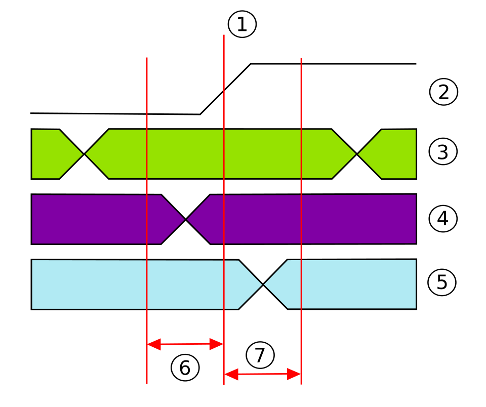

# 03 — 디지털 설계와 타이밍 (Setup/Hold + Verilog)

> 목표: 게이트(01장)를 "클럭에 맞춰" 동작시키는 법. 왜 칩에 최고 속도 한계가 생기는지.

---

## 1. 왜 클럭(Clock)이 필요한가

게이트만 있으면 신호가 제멋대로 도착한다. 순서를 맞추려면 **박자**가 필요하다. 그게 **클럭** — 일정 간격으로 0↔1을 반복하는 신호(예: 2GHz = 초당 20억 번).

### "제멋대로 도착"의 정체 — 글리치(Glitch)

같은 입력 신호가 회로 안에서 여러 갈래로 갈라졌다가 한 게이트에서 다시 합쳐지는 구조(reconvergent fanout)에서는, 갈래마다 거치는 게이트 개수(경로 길이)가 달라 도착 시각이 어긋난다. 그 틈에 게이트가 "아직 다 안 바뀐 조합"을 순간적으로 읽어 잘못된 값을 잠깐 내보낼 수 있다 — 이게 글리치(hazard)다. 예: `F = A AND NOT(A)`는 논리적으로 항상 0이어야 하지만, `NOT(A)` 쪽이 인버터를 거치느라 한 박자 늦게 바뀌는 그 짧은 틈에 F가 잠깐 1로 튄다.

중요한 건 **게이트도 FF도 이게 글리치인지 진짜 값인지 구별할 방법이 없다**는 것 — 둘 다 그 순간의 전압을 정직하게 반영할 뿐이다. 그래서 "글리치를 걸러내는 회로"를 만드는 게 아니라, **글리치가 다 끝나고 최종값이 정착하는 시간(최악의 경우)을 미리 계산해서, 그 시간이 클럭 엣지보다 확실히 먼저 끝나도록 설계**하는 것으로 해결한다 — 이게 3절 Setup time과 STA가 하는 일이다.

모든 동기 회로는 "클럭이 뛸 때마다 한 걸음씩" 전진한다. 걸음을 저장하는 그릇이 **플립플롭(Flip-Flop, FF)**.

---

## 2. 플립플롭 — 1비트 저장 그릇

FF는 **클럭 엣지(올라가는 순간)에만** 입력 D를 잡아서 출력 Q로 내보낸다. 그 사이에는 값을 붙잡고 있다.


*D 입력, CLK(클럭), Q 출력. 클럭이 올라가는 순간의 D 값이 Q에 저장된다. 왼쪽 아래의 리본처럼 보이는 기호는 입력선이 삼각형(▷) 한가운데를 관통해서 그렇게 보이는 것뿐 — "이 핀은 레벨이 아니라 엣지에 반응한다"는 표준 클럭 입력 기호다. Q̄(낫큐)는 Q의 반대값을 내보내는 보조 출력으로, 지금 단계에선 몰라도 된다. 출처: Wikimedia `D-Type Flip-flop dual.svg`*

이 박스 하나가 FF를 나타내는 **회로 기호(블랙박스)**다. 내부는 실제로 래치 두 개를 클럭 반대 위상으로 이어붙인 구조(master-slave)라, 트랜지스터가 약 20개 안팎 들어간다 — [SRAM 6T 셀](02_memory_cell_architectures.md)의 3~4배 수준인데, "레벨 감지 래치 1개"로는 엣지 트리거가 안 되고 반드시 래치 2개(마스터+슬레이브)를 엇갈려 여닫아야 "엣지 순간에만 캡처"가 성립하기 때문이다.

회로 구조:
```
[FF] --- 조합논리(게이트들) --- [FF] --- 조합논리 --- [FF]
  ↑클럭        ↑클럭         ↑클럭
```
**↑클럭 표시는 모든 FF가 같은 클럭 신호를 동시에 공유한다는 뜻**이다 — 그래서 엣지가 한 번 뛰면 모든 FF가 동시에 한 걸음씩 전진한다. FF 사이의 게이트 뭉치(조합논리)를 신호가 통과하는 데 시간이 걸린다. **이 시간이 클럭 주기보다 길면 안 된다.** 여기서 타이밍 제약이 나온다.

---

## 3. Setup / Hold Time — 칩 속도의 진짜 한계 ★

FF가 데이터를 제대로 잡으려면, 클럭 엣지 **전후로** 데이터가 흔들리지 않고 안정돼 있어야 한다.


*①은 클럭이 실제로 튀는 기준 순간(엣지), ②는 그 클럭 신호 파형이다. ③④⑤는 서로 다른 시점에 전환되는 데이터 신호 3가지 예시(이르게/걸치게/늦게 바뀌는 경우를 각각 보여준다). ⑥ = Setup time(엣지 이전 안정 요구 구간), ⑦ = Hold time(엣지 이후 안정 요구 구간). 이 창 안에서 데이터가 바뀌면 오류. 출처: Wikimedia `Setup&Hold time 1.svg`*

- **Setup time**: 클럭 엣지 **이전에** 데이터가 미리 준비돼 있어야 하는 최소 시간
- **Hold time**: 클럭 엣지 **이후에도** 잠깐 데이터를 유지해야 하는 최소 시간
- 위반하면 → **메타안정성(metastability)**: FF 출력이 0도 1도 아닌 엉거주춤한 값 → 시스템 오류

> Setup/Hold 구간은 "그 순간 값이 맞는가"가 아니라 **"구간 전체 동안 한 번도 안 흔들렸는가"**를 요구한다. 글리치처럼 일시적으로 튀는 값도 이 구간 안에서 일어나면 그 자체로 위반이다.
>
> 그리고 Setup time 자체는 (조합논리 지연과는 별개로) **FF 내부 회로 고유의 특성**이다 — D 입력이 FF 내부 저장 노드까지 전파돼 확실히 정착하는 데 필요한 최소 시간으로, 셀 라이브러리에 스펙으로 박혀 있다.

### Setup Violation (가장 흔함, 그림의 보라색 신호)
데이터가 너무 **늦게** 도착. 원인:
- 조합논리 경로(Critical Path)가 너무 길다
- 클럭이 너무 빠르다 (주기 < 신호 전달 시간)
- 온도 상승으로 트랜지스터가 느려짐

```
Setup 여유(slack) = 클럭주기 − 신호전달시간 − Setup time − 클럭 skew
slack < 0  →  위반 (이 속도로는 동작 불가)
```

> **Slack** = 허용 가능한 시간 − 실제 걸린 시간(여유). 양수면 정상, 음수면 위반.
> **Skew** = 클럭이 FF마다 도착하는 시각의 차이 — 방향 상관없이 빠를 수도 늦을 수도 있다(clock tree의 배선 길이·버퍼 차이 때문). 어느 방향이냐에 따라 Setup엔 유리/Hold엔 불리, 혹은 그 반대로 작용한다.

### Hold Violation (그림의 하늘색 신호)
데이터가 너무 **빨리** 바뀜. 원인: 데이터 경로가 지나치게 짧거나 클럭 skew(FF마다 클럭 도착 시각이 다름).

### 해결책
| 위반 | 해결 |
|------|------|
| Setup | 클럭 느리게 / 파이프라인 단계 추가 / 논리 최적화 / 빠른 셀로 교체 |
| Hold | 데이터 경로에 버퍼(지연) 삽입 |

> **파이프라인**: 긴 경로를 FF로 잘게 끊어 각 단계를 짧게 → 클럭을 더 빠르게. CPU가 GHz로 도는 비결.

---

## 4. "속도가 안 나온다" 추적법

실무에서 "동작 속도가 목표에 못 미친다, 원인을 찾아라"라는 문제는 이 순서로 접근한다:

```
1. STA(정적 타이밍 분석) 리포트에서 어느 경로가 Setup 위반인지 확인
2. 그 Critical Path에서 가장 지연이 큰 셀/배선을 특정
3. 원인 분류:
   - 셀이 느림 → drive strength 큰 셀로 교체
   - 배선이 김 → 버퍼 삽입, 재배선
   - 환경 조건(고온/저전압) → worst-case corner 재검토
4. 수정(ECO) 후 재검증
```

💡 **시스템·SW 관점**
> 이 "가장 느린 경로를 찾아 병목을 제거"하는 사고는 **SW 성능 프로파일링과 완전히 동일**하다. Critical Path 분석은 SW의 병목 구간 단계별 추적과 같은 방법론이다. Setup/Hold 위반은 **멀티스레드의 race condition**, 클럭 skew는 **분산 시스템의 clock drift(NTP 동기화)**와 같은 문제 구조다.
> - **Race condition 매핑**: 조합논리 = 값을 쓰는 writer, 클럭 캡처 = 읽는 reader. Setup 위반 = writer가 다 쓰기 전에 reader가 읽음(너무 이른 read → torn read), Hold 위반 = reader가 다 읽기 전에 writer가 다음 값을 씀(너무 빠른 write로 오염). Setup+Hold 구간은 SW의 락(lock)이 "이 구간엔 다른 접근 금지"를 보장하는 것과 같은 역할.
> - **Clock skew 매핑**: 클럭 트리는 NTP처럼 "하나의 기준 시각"을 여러 노드(FF)에 뿌리는데, 배선 지연 차이로 노드마다 도착 시각이 어긋난다. NTP가 drift를 완전히 없애지 못하고 프로토콜 설계에서 그 오차를 감안하듯, 클럭 트리도 skew를 최소화(Clock Tree Synthesis)하고 남은 오차를 slack 수식에 명시적으로 반영한다.

---

## 5. Verilog — 하드웨어를 글로 쓰는 언어

회로를 손으로 그리는 대신, **텍스트로 기술**하면 EDA 툴이 게이트로 변환(합성)해준다. 그 언어가 Verilog(HDL).

### SW와 결정적 차이: 전부 "동시에" 동작
```python
# 소프트웨어: 위에서 아래로 순차 실행
c = a + b
```
```verilog
// 하드웨어: 아래 줄들이 물리적으로 동시에 항상 동작
assign c = a + b;
assign d = b & e;   // c 계산과 동시에
```

### 두 종류의 회로 기술
```verilog
// 조합논리: 클럭 없음, 입력 바뀌면 즉시 반응
assign out = ~(a & b);       // NAND
always @(*) out = sel ? a : b; // 멀티플렉서

// 순차논리: 클럭 엣지에만 반응 → FF로 합성
always @(posedge clk) begin
    q <= d;    // non-blocking(<=) 사용
end
```

> 멀티플렉서(mux) 회로 그림 — `sel`이 0이면 a, 1이면 b가 out으로 나간다:
> ```
> a ──┐
>     ×── out
> b ──┘
>      │
>     sel
> ```

- **wire vs reg — 문법 타입이지, 하드웨어 여부가 아니다**: `wire`는 assign으로 지정하는 순수 연결선(그 자체로 저장 능력 없음). `reg`는 always 블록 안에서 값을 대입할 때 문법상 필요한 변수 타입일 뿐 — **이름과 달리 reg로 선언했다고 무조건 진짜 FF가 되는 게 아니다.** 실제로 FF가 생기는지는 always가 `posedge clk`(클럭 엣지 → FF)인지 `@(*)`(조합논리, 모든 경우를 다 커버하면 → 그냥 게이트)인지로 결정된다. 위 mux 예시의 `out`은 `@(*)` 안이라 reg로 선언해도 FF가 안 생기고 순수 게이트로 합성된다.
- **레지스터 = FF의 다른 이름**: 여러 비트를 묶어 저장하면 "레지스터"라 부르고, 그 안엔 비트 수만큼의 FF가 들어있다(1비트짜리 레지스터 = FF 1개와 동일).
- 순차논리엔 `<=`(non-blocking), 조합논리엔 `=`(blocking). 섞으면 버그. 구체적으로 시프트 레지스터를 보면:
  ```verilog
  always @(posedge clk) begin
      q1 <= d;   // non-blocking: 엣지 직전의 d, q1 값을 모두 "동시에" 읽어서 갱신
      q2 <= q1;  // q2는 방금 계산되는 새 q1이 아니라 "직전 값" q1을 받는다
  end
  ```
  `<=`는 실제 FF 두 개(q1, q2)가 같은 클럭 엣지에 각자 독립적으로 반응하는 물리적 동작을 그대로 흉내낸다. `=`(blocking)를 쓰면 SW처럼 위에서 아래로 순서대로 실행돼 q2가 방금 갱신된 새 q1을 받아버려, 두 FF가 한 클럭에 걸어야 할 두 걸음이 한 걸음으로 뭉개진다 — 실제 회로와 안 맞는 결과.
- **Latch vs FF**: Latch는 레벨 감지(열려있는 동안 통과), FF는 엣지 감지(순간 포착). always 블록에서 조건을 빠뜨리면 의도치 않은 latch가 생겨 타이밍 문제 유발.

💡 **시스템·SW 관점**
> Verilog의 "모든 문장이 병렬 실행"은 함수형 프로그래밍의 순수 함수들이 항상 동시에 도는 것과 같다. 동시성(concurrency)을 다뤄본 SW 엔지니어에겐 오히려 자연스럽다.

## 메모리 칩에서의 적용
메모리 칩의 주변 회로(컨트롤러, 인터페이스)는 디지털 로직이고 Verilog로 설계·검증한다. 회로검증 트랙의 핵심이 타이밍 검증(STA)과 커버리지다.

> **커버리지(coverage)**: STA가 "제시간에 동작하는가(속도)"를 보는 거라면, 커버리지는 "로직이 의도대로 맞게 동작하는지 충분히 테스트했는가(기능)"를 재는 지표다. 코드 커버리지(모든 줄/분기/상태를 시뮬레이션이 실행해봤는가), 기능 커버리지(검증 엔지니어가 정의한 시나리오를 다 실행해봤는가) 등이 있다. 입력 조합이 사실상 무한대라 전수 검증이 불가능하기 때문에, "얼마나 철저히 테스트했는가"를 수치로 추적해 검증의 신뢰도를 관리한다.

---

## 확인 문제
1. 왜 디지털 회로에 클럭이 필요한가?
2. Setup time과 Hold time을 각각 한 문장으로.
3. Setup violation의 대표 원인 2개와 해결책은?
4. 파이프라인이 어떻게 클럭 속도를 높이나?
5. Verilog가 소프트웨어 언어와 근본적으로 다른 점은?
6. non-blocking(`<=`)은 언제 쓰나?

---

**이전 ← [02: 메모리 셀 구조](02_memory_cell_architectures.md) | 다음 → [04: 아날로그 회로와 신호 무결성](04_analog_signal_integrity.md)**
